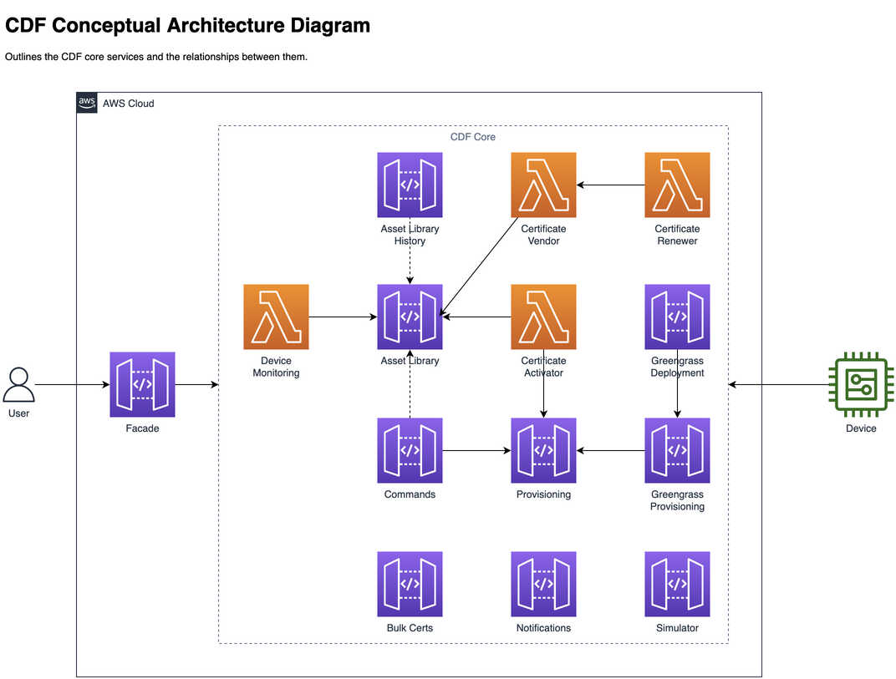
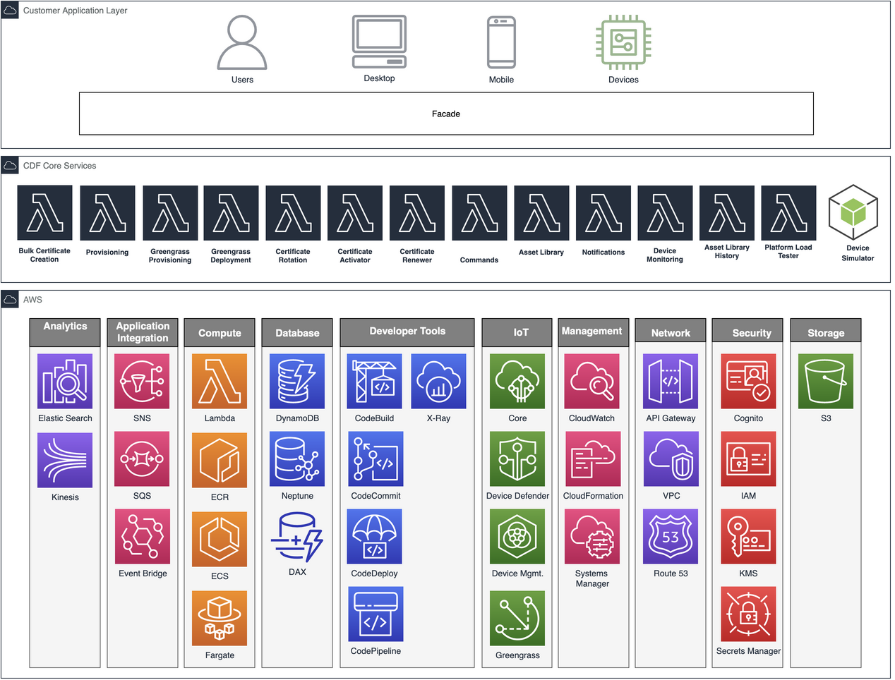

# AWS Connected Device Framework
## Introduction

Managing connected devices involves multiple phases of a device's lifecycle.  The phases a typical connected device goes through are : manufacturing, onboarding, operations, support and analytics.  In each of these phases, a unique set of capabilities are required.  The AWS Connected Device Framework (CDF) encompasses a set of modular micro-services (referred to simply as modules) to cater to connected devices in each of their lifecycle phases.

The framework is particularly well suited for enterprise use cases which require product definition, onboarding and managing a diverse ecosystem of connected devices. The included modules facilitate:

* Product template definition
* Provisioning
* Configuration and software updates
* Organizing devices into hierarchies
* Maintaining and updating device configuration
* Device command and control
* Device simulation
* Fleet simulation

## FAQ

TLDR: Read the [FAQ](source/docs/faq.md).

## Changelog

Changelog and release artifacts can be found [here](https://github.com/aws/aws-connected-device-framework/releases).

Details on any major changes along with migration instructions can be found in the [Migration Guide](source/docs/migration.md).

## Tags / Branches

If deploying to a production environment, always ensure you are checking out one of the release tags rather than checking out the `main` branch. This will ensure you do not inadvertently deploy a new version of the framework without testing it first.

Any other branches besides `main` and the release tags are considered experimental / in-progress and should be used with caution. Once the branch is merged into the `main` branch, it will be considered stable and will be released as a release.

## Challenges

Implementing, deploying and maintaining IoT services can be significantly more complex than traditional software services due to a number of challenges faced:

**Significant undifferentiated heavy lifting:**  It can take months, if not years, to build out an IoT platform.

**Skills gap:**  Finding product and IoT specialists is one problem, but then needing to find those same people who possess AWS knowledge is significantly harder.

**Bridging historically air-gapped systems:**  Traditionally different areas within a business, such as manufacturing, operations, and support, have been isolated from one another.  Implementing a new IoT service is a once in a generation opportunity to look at the efficiencies of bridging these systems and future proof for growth.

**Limitations with turn-key solutions:**  Off-the-shelf solutions may be opinionated in their implementation such that incompatible limitations are introduced, as well as potential scalability issues.

**Legacy devices:**  There may be an existing population of devices deployed in the wild that need to be transitioned into a new IoT service.

**Complex security requirements:**  Constrained, intermittently connected devices, as well as regional governance, introduce complexity.

**Long term maintainability of software:**  If a software's architecture and implementation does not take into consideration its longevity that comes with unforeseen emerging requirements, its maintainability, scalability and reliability can be significantly impacted as well as a business losing its agility to bring new products and services to market.

The ***AWS Connected Device Framework (CDF)*** is a platform comprising of a number of production ready micro-services, all architected and implemented using software and AWS best practices, which builds upon the AWS IoT building blocks to address these challenges.

## Device Lifecycle View

The CDF modules span the following life cycle phases:

## AWS Connected Device Framework Modules

AWS CDF is comprised of the following modules. You only need to deploy and enable the modules that you are interested in using:

### Bulk Certificate Creation

With this module a user can request large batches (think 1000's) of device certificates and public/private keys which can later be loaded onto a device. This is useful where customers have a hardware vendor who may not have the ability to create their own device certificates, and the customer does not want to share their CA, so instead can provide access to this module to create the device certificates as required.

See [overview](source/packages/services/bulkcerts/README.md).
### Provisioning

The provisioning module utilizes [AWS IoT Device Provisioning](https://docs.aws.amazon.com/iot/latest/developerguide/iot-provision.html) to provide both programmatic and bulk device provisioning capabilities.  The provisioning module simplifies the use of AWS IoT Device Provisioning by managing a set of provisioning templates to use with both provisioning approaches.

In addition, it allows for extending the capabilities of the AWS IoT Device Provisioning template functionality.  To provide an example, an AWS IoT Device Provisioning template allows for creating certificate resources by providing a certificate signing request (CSR), a certificate ID of an existing device certificate, or a device certificate created with a CA certificate registered with AWS IoT.  This module extends these capabilities by also providing the ability to automatically create (and return) new keys and certificates for a device, or to create a device certificate without the CA being registered in the account.

See [overview](source/packages/services/provisioning/README.md).
### Greengrass V2 Provisioning

Takes care of everything cloud side when it come to Greengrass v2. Allows you to define a template of components to deploy as a Greengrass core, as well as the cloud provisioning of Greengrass core and connected devices. In addition allows you to manage and roll out updates at scale..

See [overview](source/packages/services/greengrass2-provisioning/README.md).

### Device Patcher

Allows for the remote installation and configuration of physical devices, such as remotely installing device certificates and the Greengrass SDK on devices intended to be Greengrass core devices.

See [overview](source/packages/services/device-patcher/README.md).

### Certificate Renewer

*NOTE: Will be released once fully tested.*

Identifies soon to expire certificates, and if the device is still active/authorized, will create and register new certificates, then inform the device of the new certificate being available.

See [overview](source/packages/services/certificaterenewer/README.md).

### Certificate Vendor

Manages the secure delivery of certificates, whether delivered over mqtt or to be downloaded from S3, to a device that can be used for elevating and/or rotating certificates.

See [overview](source/packages/services/certificatevendor/README.md).

### Certificate Activator

Provides a reference implementation of how to combine JITR (Just In Time Registration) functionality with the rest of CDF:  verifies certificates against a whitelist / certificate revocation list, provisions devices, and uses Asset Library profiles to initialize a device’s data.

See [overview](source/packages/services/certificateactivator/README.md).

### Asset Library

An enhanced device registry that augments (not replaces) the AWS IoT Device Registry, allowing one to manage their fleet of devices placed within multiple hierarchical groups.  Each group within a hierarchy can represent something meaningful to the business such as location, manufacturer, device types, firmware versions, etc.

With the Asset Library one can define complex models, such as modeling the components of a vehicle.

See [overview](source/packages/services/assetlibrary/README.md).
### Notifications

Allows one to configure types of events (such as a low battery alert) from multiple different event sources (AWS IoT Core, DynamoDB Stream, Kinesis Data Stream, API Gateway), which interested parties (user, service) can subscribe to receive alerts on events via SNS, MQTT republish, mobile push, or to store in a DynamoDB table.

See [overview](source/packages/services/events-processor/README.md).

### Device Monitoring

Detects the connected status of a device (replaced by Fleet Indexing capabilities, but still useful if a customer is not using Fleet Indexing).

See [overview](source/packages/services/device-monitoring/README.md).

### Commands

Utilizes AWS IoT Jobs to issue commands to a device or set of devices, and optionally inspect their execution status.  It augments AWS IoT jobs by providing the ability to create Job templates (job document, parameters, and files), and enforcing that each requested command adheres to a template before executing.

Also allows for sending jobs to thousands of devices, by automatically managing temporary groups to overcome any limitations with the no. of allowed targets.  Can optionally use Asset Library devices, groups, and search queries as Job targets.

See [overview](source/packages/services/commands/README.md).

### Asset Library History

Tracks and stores all changes made to the Asset Library (devices, groups, policies and/or templates) for auditing purposes.

See [overview](source/packages/services/assetlibraryhistory/README.md).

### Reference implementations

*NOTE: Not released yet.*

A simple demo implementation, as well as a full featured implementation (Connected Mobility Solution) are available for reference.

### CI/CD

Fully automated AWS CodePipeline based continuous delivery pipeline, managing the building, testing, and deployment of modules.

### Logging

CloudWatch based logging.  X-Ray support.

### Authn / Authz

Supports multiple authentication options: Lambda (request and token) authorizers, IAM, Cognito, API keys, and private API Gateway.

The Asset Library supports a fine-grained access control mode, suitable for multi-tenancy scenarios.

### Device simulator

*NOTE: Reference implementation on how to use is not released yet.*

A framework that can be followed to implement a device simulator. Includes a reference implementation of a smart Kettle device, as well as a more advanced reference implementation of a vehicle simulator.

### Fleet simulator

See [overview](source/packages/services/simulation-manager/README.md).

Scales out device simulators for load testing your platform, as well as executing test plans to test other areas of your platform.

## Architecture

The CDF modules can be mostly deployed independently. The following shows dependencies between the modules (dotted line is an optional dependency).

The CDF modules form a layer above the AWS building blocks as shown in the following architecture diagram. A typical customer deployment will involve the development of facade layer (the consuming application(s) of CDF modules) that contains the customer's unique business logic and orchestrates the underlying CDF modules.

## Development
- [Getting Started](source/docs/development/quickstart.md)
- [Prerequisites for Development](source/docs/development/prerequisites.md)
- [Consuming application (aka facades)](source/docs/consuming-application.md)
- [Tech Stack](source/docs/development/tech-stack.md)
- [Dependency Injection](source/docs/development/dependency-injection.md)
- [Unit testing](source/docs/development/unit-testing.md)

## Deployment
- [Release notes](https://github.com/aws/aws-connected-device-framework/releases)
- [Migrating major changes](source/docs/migration.md)
- [Deploying](source/docs/deployment.md)
- [Private API Gateway support](source/docs/private_api_gateways.md)
- [CI/CD](source/docs/cicd.md)

## Copyright

Copyright Amazon.com, Inc. or its affiliates. All Rights Reserved.

Licensed under the Apache License Version 2.0 (the "License"). You may not use this file except in compliance with the License. A copy of the License is located at

    http://www.apache.org/licenses/

or in the "license" file accompanying this file. This file is distributed on an "AS IS" BASIS, WITHOUT WARRANTIES OR CONDITIONS OF ANY KIND, express or implied. See the License for the specific language governing permissions and limitations under the License.
