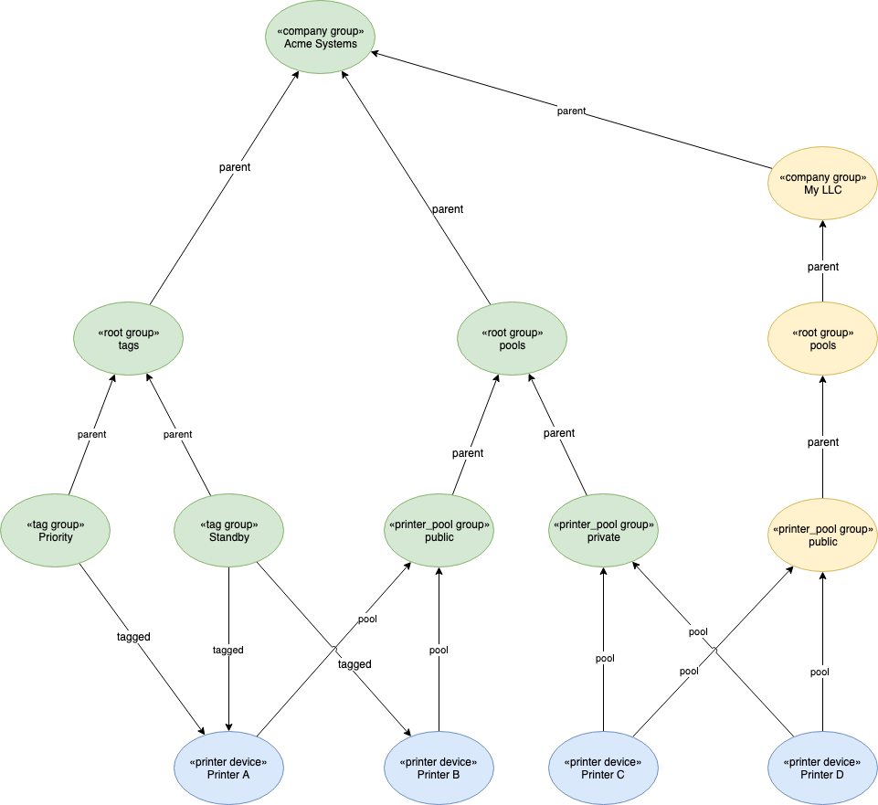

# ASSET LIBRARY FINE-GRAINED ACCESS CONTROL

## High Level Approach

Fine-grained access control is supported in _full_ mode only.

A user’s allowed access to group hierarchies, and their allowed operations on these hierarchies, is managed via an external IdP (such as Cognito).

When constructing a data model within Asset Library, devices and groups are organized into group hierarchies.  Each group within a hierarchy is identified by a unique group path.  When fine-grained access control is enabled for an Asset Library deployment, the IdP will allow for CRUD method operations and group paths to be added to an identities claims.  These claims will be passed to the Asset Library as part of the identities JWT token, with the JWT token being first validated by an API Gateway custom authorizer.

Within Asset Library, any attempted access to a device or group will be validated by traversing all outgoing relations to the device/group.  Only operations on devices/groups that belong to group hiersrchies that are present in the identities claims, along with the allowed access level, will be performed.

## Detailed Approach

### Example graph

Let’s take an example of a graph that we will refer to in the following sections:



This example has a concept of multi-tenancy (multiple companies at the top level represented as groups).  Printers are the modeled devices, with the printers being shared across the different companies.  Access to the printers is managed per company via company specific pools represented as groups.  Each company can also have its own tag groups.  Tags are used to group devices for searching, whereas pool groups are used as authorization to specific devices.  The naming and structure of these groups is irrelevant.

The following are the authorization constraints that need to be applied for the example:

* Users within a company can only see printers that are assigned to pool groups that they have access to
* Users can search for devices associated with tags associated with their company

### Example Asset Library Data Model Configuration

In the above example, we configure tenants (companies) as a top level group in the hierarchy. 

Template:
```json
{
    "templateId": "company",
    "category": "group",
    "properties": {
        "classification": {
            "type": "string",
            "enum": ["Super","EndCustomer","Reseller"]
        }
    },
    "relations": {},
    "required": ["classification"]
}
```

Example:
```json
 {
    "attributes": {
        "classification": "Super"
    },
    "category": "group",
    "templateId": "company",
    "parentPath": "/",
    "name": "Acme Systems",
    "groupPath": "/acme systems"
}
```

Next level, we configure 2 root groups to act as containers for tags and pools respectively.  Their parent being a company group.  This will allow us to restrict access at different levels of group hierarchies:

Example:
```json
{
    "attributes": {},
    "category": "group",
    "templateId": "root",
    "name": "tags",
    "groupPath": "/acme systems/tags",
    "parentPath": "/acem systems"
} 
{
    "attributes": {},
    "category": "group",
    "templateId": "root",
    "name": "pools",
    "groupPath": "/acme systems/pools",
    "parentPath": "/acem systems"
}
```

The next level in our example we have tags specific to a company.  Tags are used in searching across devices:

Template:
```json
{
    "templateId": "tag",
    "category": "group",
    "properties": {},
    "relations": {
        "out": {
            "tagged": ["printer"]
        }
    },
    "required": []
}
```

Example:
```json
{
    "attributes": {},
    "category": "group",
    "templateId": "tag",
    "name": "Priority",
    "groupPath": "/acme systems/tags/priority",
    "parentPath": "/acme systems/tags"
}
```

At the same level of tags, we also have printer pools:

Template:
```json
{
    "templateId": "printerpool",
    "category": "group",
    "properties": {},
    "relations": {
        "in": {
            "pool": [
                "printer"
            ]
        }
    },
    "required": []
}
```

Example:
```json
{
    "attributes": {},
    "category": "group",
    "templateId": "printerpool",
    "name": "Public",
    "groupPath": "/acme systems/pools/public",
    "parentPath": "/acme systems/pools"
}
```

At the bottom level we have the printers (devices) which are associated with a companies tags and pools.  Note that the printerpool group has an outgoing relation, so it is this group hierarchy that will be traversed to carry out authorization checks.  Tags are incoming relations, therefore are used for grouping only. 

Template:
```json
{
    "templateId": "printer",
    "category": "device",
    "properties": {
        "product": {
            "type": "string"
        },
        "model": {
            "type": "string"
        },
        "serialNumber": {
            "type": "string"
        }
    },
    "relations": {
        "out": {
            "pool": [
                "printerpool"
            ]
        },
        "in": {
            "tagged": [
                "tag"
            ]
        }
    },
    "required": ["model","serialNumber"]
}
```

Example:
```json
{
    "groups": {
        "pool": [
            "/acme systems/pools/public"
        ],
        "tagged": [
            "/acme systems/tags/priority"
        ]
    },
    "attributes": {
        "product": "Acme Pro Line",
        "serialNumber": "ABC123",
        "model": "4001"
    },
    "category": "device",
    "templateId": "printer",
    "state": "active",
    "deviceId": "printer_a"
}
```

### IdP Configuration

The external IdP should allow for the configuring of claims by specifying a group path along with allowed operations.  The following represent example custom claims where the claim key is `cdf_al`, and the claim value is an array of group paths along with allowed claim access levels: ‘C’reate, ’R’ead, ’U’pdate, ’D’elete, or ’*‘ as a shortcut for full privileges:


| Role | Description | Custom Claims |
|---|---|---|
| Super Administrator | Full privileges to entire Asset Library	| "cdf_al": ["/:*"] |
| Company Administrator | Full privileges to a specific tenant | "cdf_al": ["/acme solutions/my llc/:*"] |
| Super User | Able to manage tags, and manage a specific pool of printers | "cdf_al": ["/acme solutions/tags:*","/acme solutions/pools/public:*"] |
| User | Able to use tags, and use printers from a specific pool | "cdf_al": ["/acme solutions/tags:R","/acme solutions/pools/public:R"] |

An example (decrypted) JWT payload generated by the IdP including the custom claims would be:
```json
{
  "iss": "Some IdP",
  "iat": 1570654016,
  "exp": 1602190016,
  "cdf_al": ["/acme solutions/tags:R", "/acme solutions/pools/public:R"]
}
```

### Asset Library Authorization Checks

Authorization checks via supplied JWT tokens are configurable via feature toggles per installation.  By default, for backwards compatability, fine-grained access control is disabled.

If enabled, an API Gateway Custom Authorizer is deployed and configured for use with the Asset Library with the sole responsibility of verifying the supplied JWT (structure checks, signature verification, standard claims, expiration, etc).  If trusted, the request will be forwarded to the Asset Library.

As fine-grained access controls needs to be carried out at the group/device level within the group hierarchies, it is not possible to perform the authorization checks within the service layer as the service layer has no knowledge of a groups/devices hierarchy.  The authorization checks are carried out in the data layer to allow for fast and efficient checks.

All of the device/group REST API’s start with a specific device/group in context.  For these types of queries, a preliminary query can be executed to see if a user has access to the device/group in context via one of its hierarchy as follows:

Psuedo code:
```sh
1. Lookup matching group claims:
    1. Starting with the device
        1. Navigate all outgoing links through all related hierarchies until one of the paths defined in a claim is found
        2. Return these matched group paths to the Asset Library
2. Compare matched group claims:
    1. For each returned matched group, compare the required authorization level with the authorization level claimed
3. If authorized, proceed as normal
```

Example Gremlin query to satisfy item 1 above using a traversal query looking for exact matches:
```sql
g.V('device___20000-30091278003').
      until(
         has('groupPath',within('/acme systems/pools/public'))
      ).
      repeat(out()).values('groupPath')
```

The search REST API behaves in a different manner to the devices/groups.  Instead of starting with a specific device/group in context, it searches across all devices/groups.  For this, a Gremlin _match_ command is performed to ensure returned devices/groups are part of a group hierarchy the user has access to.

Example Gremlin query adding a match statement to the existing search query, ensuring the returned devices/groups can be accessible via the allowed public and private pool for customer Acme Systems:

```sql
g.V().as('a').
 match(
   .as('a').hasLabel('printer'),
   .as('a').until(hasId('group___/acme systems/pools/public', 'group___/acme systems/pools/private')).repeat(__.out())
 )
 ```


### Asset Library REST API Updates

Any REST API actions deemed as not allowed due to failed authorization checks will return _403 Forbidden_.

Prior to this new feature, only outgoing relations from devices to group hierarchies were allowed.  Due to this, there was no need to identify incoming vs outgoing relations in the device related REST API responses.  As we now need to differentiate, a version 2 of the API (`application/vnd.aws-cdf-v2.0+json`) is supported that identifies incoming vs outgoing separately.  The existing version 1 of the API remaina as-is.
