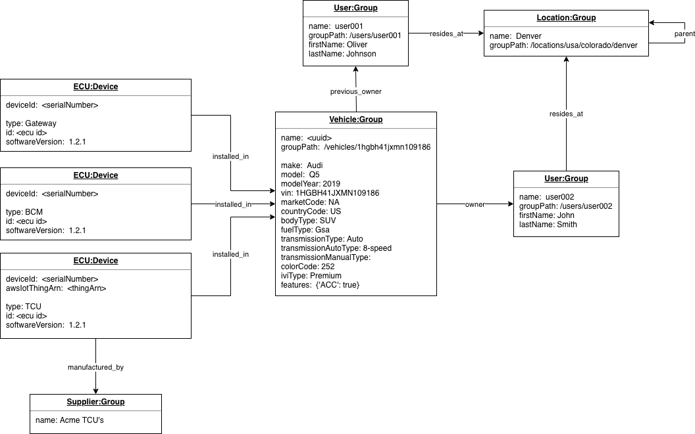
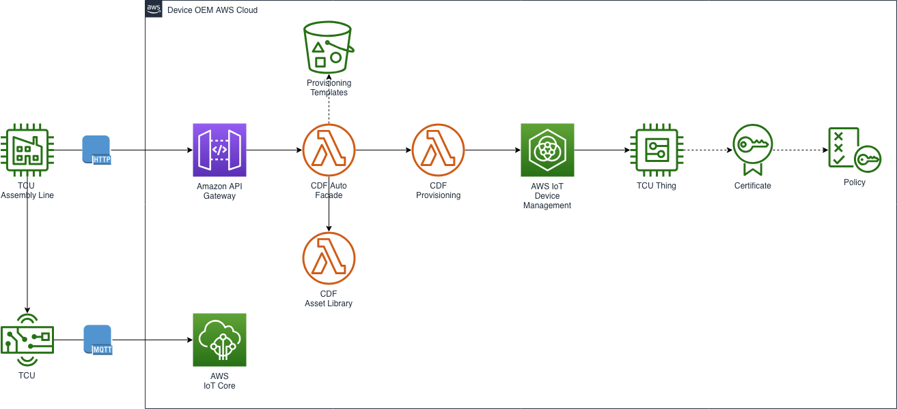
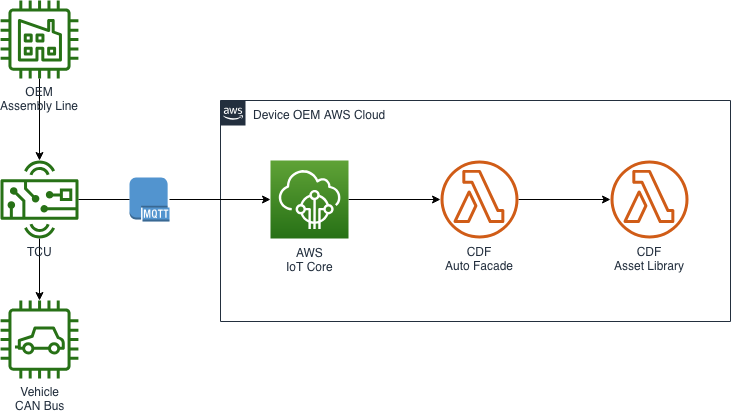
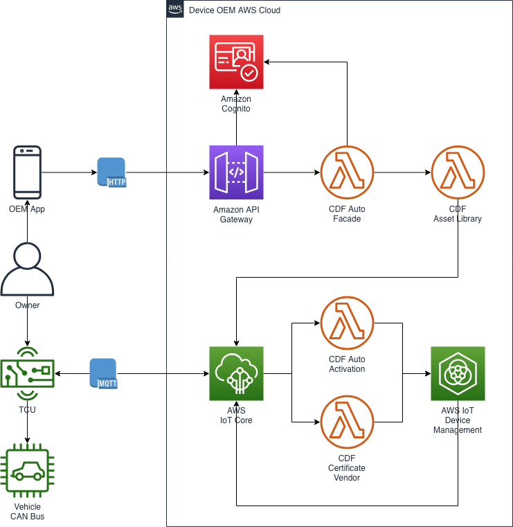

# CDF AUTO

## Introduction

CDF Facade Auto is a CDF verticial solution for Connected Vehicles.  As well as a facade and infrastructure project, it includes device simulation orchestration and management services and a Fleet Management UI. The high-level automotive features include having the ability to model vehicle manufacturers, TCU/ECU suppliers and Vehicle ownership.

The following Asset Library model illustrates the relationship between different entities such as vehicle, supplier, owner and device.

**Data Model**



## Deployment

Prerequisities 

* _cdf-infrastructure-auto_ project configured
* CDF Project dependencies installed and configured

Steps to deploy

* Run _cdf-infrastructure-auto_ `deplooy.bash` script

Outcomes:

* CDF Core assets deployed
* CDF Auto Facade deployed
* CDF Auto Facade sample data seeded in asset library

NOTE:  Still to document:

* CDF Device Simulator configuration, installation and execution
* Fleet Management UI configuration, installation and execution

## Description
The facade layer exposes a REST API that provides interfaces to execute the vehicle provisioning flow. The REST API includes endpoints representing a devices lifecycle:  device assembly (registering a new TCU device), device installatin (creating a vehicle and associating the TCU device), and vehicle ownershiip (registering a vehicle owner and associating with a vehicle).

To provision a vehicle, pair a device and associate an owner, the following steps are involved

1. (Device assembly) A supplier manufactures a _TCU_ and registers it during the manufacturing process, associating with a low privilege policy and certificate.
2. (Device installation) The vehicle manufacturer installs a TCU into a vehicle, activating its certificate.
3. (Vehicle ownership) An owner buys the vehicle from the dealer and using an OEM app the owner registers as a user. The vehicle owner pairs the app with the vehicle and claims ownership over it.

| Workflow            | API                                                        |
|---------------------|------------------------------------------------------------|
| Device assembly | POST - /suppliers/{supplierId}/devices/{deviceId}/register |
| Device installation  | POST - /suppliers/{supplierId}/devices/{deviceId}/activate |
| Owner registration  | POST - /users                                              |
| Vehicle ownership   | POST - /vehicles/{vin}/owners/{userId}                     |

## Device Registration 

As the TCU's are made to order, the TCU's are registered within the OEM's AWS Account.  Typically the provisioning process starts by a CSR being generated 
by the TCU's TPM as part of the assembly line process (although for the CDF Auto implementation certificates are generated on behalf of a device).  Using the CSR, a low-privilege device certificate is generated along with registering and activating a Thing within AWS IoT, and storing the TCU details (its serial no. and IMEI) within the CDF Asset Library.

Outcomes:

* Low-privilege certificate created and loaded into the TCU's TPM
* Thing registered within AWS IoT
* Low-privilege certificate and policies registered, associated and activated within AWS IoT
* Device created within CDF Asset Library
* TCU tested

**Architecture**



**Sample API Request**

```json
http request
POST /suppliers/<supplierId>/devices/<deviceId>/register HTTP/1.1
Host:  <url>
Accept: application/vnd.aws-cdf-v1.0+json
Content-Type: application/vnd.aws-cdf-v1.0+json

{
	"templateId": "auto_ecu",
	"certificateId": "xxxxxx",
	"attributes": {
        "type": "tcu",
        "model": "TCU-1"
    }
}'
```

## Vehicle Activation

During the vehicle assembly line, the TCU is installed into the vehicle and activated, along with collecting vehicle 
information to be stored within the CDF Asset Library.

**Outcomes**

* Vehicle information is captured and stored in the CDF Asset Library
* TCU is capable of publishing telemetry using its SIM, but broadcasting of telemetry is disabled

**Architecture**



**Sample API Request**

```json
http request
POST /suppliers/<supplierId>/devices/<deviceId>/activate HTTP/1.1
Host:  <url>
Accept: application/vnd.aws-cdf-v1.0+json
Content-Type: application/vnd.aws-cdf-v1.0+json

{
    "vehicle": {
        "make": "AMZ",
        "model": "A",
        "modelYear": 2019,
        "marketCode": "NA",
        "vin": "{vin}",
        "bodyType": "Saloon",
        "fuelType": "Gas",
        "transmissionType": "Auto",
        "transmissionAutoType": "7-speed",
        "colorCode": "B1B!",
        "iviType": "Premium",
        "ecus": [{
            "type": "tcu",
            "id": "{deviceId}",
            "softwareVersion": "1.9.1"
        }]
    }
}
```

## Owner Registration

The first step of this flow involves a user registering an account via the OEM Mobile App (not part of CDF Auto) which in turn adds the user to the Asset Library and creates Cognito credentials.

**Sample API Request**

```json
http request
POST /users HTTP/1.1
Host:  <url>
Accept: application/vnd.aws-cdf-v1.0+json
Content-Type: application/vnd.aws-cdf-v1.0+json

{
	"username": "jamesdoe",
	"firstName": "james",
	"lastName": "doe"
}
```

## Vehicle Ownership

Next, the new vehicle owner starts the pairing process turning on the ignition of the vehicle and obtaining a pairing code from the vehicle.  
The new owner enters this into the OEM Mobile App to start the pairing process.  In the background, while the ignition is on, the TCU is connected to and monitoring its Device Shadow with a low-privilege certiificate.

If the vehicle and TCU are whitelisted, once the Asset Library has been updated with the new owner/vehicle association, an activation 
process is asynchronously started which involves updating a Device Shadow status.  Upon the vehicle detecting this state change, it generates 
a CSR and provides it to CDF to obtain a new high-privilege certificate.  Once the vehicle receives this certificate, and rotates it certificate, 
it can start publishing telemetry.

Outcomes:

* A user is registered with the system
* An owner is associated with a vehicle
* The TCU has obtained a high-privilege certificate
* The TCU is publishing telemetry to AWS IoT

**Architecture**



**Sample API Request**

```json
http request
POST /vehicles/<vin>/owners/<username> HTTP/1.1
Host:  <url>
Accept: application/vnd.aws-cdf-v1.0+json
Content-Type: application/vnd.aws-cdf-v1.0+json

{
	"pairingCode": "12345"
}
```
