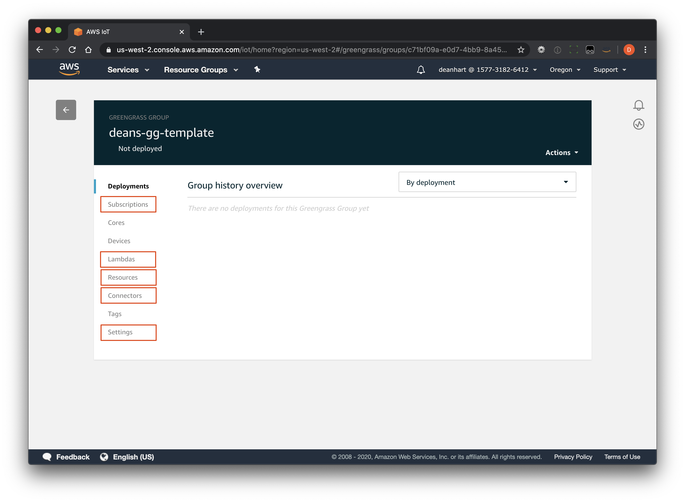

# GREENGRASS PROVISIONING OVERVIEW

## Introduction

The _Greengrass Provisioning_ service allows one to mark a Greengrass Group as a template, then create and update Greengrass Group instances in bulk based on a template.  

Note that this service must be responsible for managing the entire life cycle of a Greengrass Group. One cannot be created externally to this service, then managed by this service.

The connector, function, logger and resource definition from the Greengrass Group identified as the tenplate are associated to the new instances.  Any non-device related subscriptions are exported with a new subscription definition assigned to the new instances.  This relates to anything within the _Lambdas_, _Resources_, _Connectors_ and _Setttings_ sections, as well as non-device related configuration within the _Subscriptions_ section, of the AWS IoT Greengrass console:



In addition, subscription templates may be defined which will allow for device specific subscriptions to be created whenever a new device is added to the group.

Once a Greengrass Group has been provisioned, devices and subscriptions can be configured.

Once your fleet of Greengrass Groups are fully configured, they can be deployed in bulk.

Post deployment, a similar approach can be taken to perform bulk updates of existing Greengrass Groups.

## What's Not Included

The following functionality is not included in this initial MVP, but can be implemented once a project is able to sponsor it:

#### Greengrass group deletion

Deleting Greengrass groups, along with tearing down any associated devices, is not yet implemented.

#### Greengrass V2

This service currently onlu supports Greengrass V1.

## Walkthrough

The following represents a typical walkthrough.  Refer to the [swagger](./greengrass-provisioning-swagger.md) for further details about each API and their options.

### Step 1: Define a Template

Define an existing fully configured Greengrass Group within AWS IoT using either the AWS Console, AWS CLI, or Cloudformation.  You may also define the core, devices, and related subscriptions in order to physically test it before proceeding, as anything instance specific (devices and subscriptions) will be ignored when marked as a template.

Optionally you may specify a set of subscription templates to be applied to devices as and when they are added to the Greengrass group.

- `<template_name>` : what you want to name the template, and how it will referenced going forward

#### REQUEST

```bash
PUT /templates/<template_name>
Accept: application/vnd.aws-cdf-v1.0+json
Content-Type: application/vnd.aws-cdf-v1.0+json

{
	"groupId": "a73861fe-be5b-4dc3-a9ba-2131564b24bf",
    "subscriptions": {
        "__all": [{
            "id": "sub_${thingName}_outgoing",            
            "source": "${thingArn}",
            "subject": "dt/${thingName}",
            "target": "cloud"   
        }, {
            "id": "sub_${thingName}_incoming",         
            "source": "cloud",
            "subject": "cmd/${thingName}",
            "target": "${thingArn}"   
        }],
    }
}
``` 

#### RESPONSE

```json
{
    "groupId": "a73861fe-be5b-4dc3-a9ba-2131564b24bf",
    "name": "<template_name>",
    "groupVersionId": "3e45a797-54b9-441c-b0b3-ef6ad73d5582",
    "subscriptions": {
        "__all": [{
            "id": "sub_${thingName}_outgoing",            
            "source": "${thingArn}",
            "subject": "dt/${thingName}",
            "target": "cloud"   
        }, {
            "id": "sub_${thingName}_incoming",         
            "source": "cloud",
            "subject": "cmd/${thingName}",
            "target": "${thingArn}"   
        }],
    },
    "updatedAt": "2020-06-12T16:03:30.106Z",
    "versionNo": 2,
    "createdAt": "2020-03-16T21:42:53.594Z",
    "enabled": true
}
``` 

Specifying `groupId` without `groupVersionId` will instruct the service to use the latest Greengrass group version instead of a specific version.

All templates are versioned within the system. The first `PUT` call will create the template, whereas subsequent `PUT`'s will update it.

### Step 2: Create new Greengrass Groups

Using the template from the previous step, create a set of Greengrass groups. Note that this endpoint is a asynchronous and will process the creation of groups in the background.

#### REQUEST

```bash
POST /groupTasks
Accept: application/vnd.aws-cdf-v1.0+json
Content-Type: application/vnd.aws-cdf-v1.0+json

{
    "groups": [{
        "name": "my-group-1",
        "templateName": "my-template"
    }, {
        "name": "my-group-2",
        "templateName": "my-template"
    }]
}
``` 

#### RESPONSE

```json
{
    "taskId": "3NDPLD2FF",
    "taskStatus": "Waiting",
    "createdAt": "2020-06-11T20:52:26.890Z",
    "updatedAt": "2020-06-11T20:52:26.890Z",
    "groups": [
        {
            "name": "my-group-1",
            "templateName": "my-template",
            "id": "82a82b5e-cf01-445d-92ef-059b939c787e",
            "versionId": "92a898c2-02f8-4faa-8393-85d38e7d68e0",
            "arn": "arn:aws:greengrass:us-west-2:123456789012:/greengrass/groups/82a82b5e-cf01-445d-92ef-059b939c787e",
            "templateVersionNo": 1,
            "versionNo": 1,
            "createdAt": "2020-06-11T20:27:47.797Z",
            "updatedAt": "2020-06-11T20:27:47.797Z",
            "deployed": false,
            "taskStatus": "Success"
        }, 
        {
            "name": "my-group2",
            "templateName": "my-template",
            "templateVersionNo": 1,
            "taskStatus": "Waiting"
        }
    ]
}
``` 

### Step 3: Check the Status of the Group Task

As mentioned in the previous step, the Greengrass Group creation is asynchronous. The status of the Greengrass Group creation task can be checked using its taskId.

#### REQUEST

```bash
GET /groupTasks/<task_id>
Accept: application/vnd.aws-cdf-v1.0+json
Content-Type: application/vnd.aws-cdf-v1.0+json
``` 

#### RESPONSE

```json
{
    "taskId": "3NDPLD2FF",
    "taskStatus": "Success",
    "createdAt": "2020-06-11T20:52:26.890Z",
    "updatedAt": "2020-06-11T20:52:26.890Z",
    "groups": [{
        "name": "my-group-1",
        "templateName": "<template_name>",
        "id": "82a82b5e-cf01-445d-92ef-059b939c787e",
        "versionId": "92a898c2-02f8-4faa-8393-85d38e7d68e0",
        "arn": "arn:aws:greengrass:us-west-2:123456789012:/greengrass/groups/82a82b5e-cf01-445d-92ef-059b939c787e",
        "templateVersionNo": 1,
        "versionNo": 1,
        "createdAt": "2020-06-11T20:27:47.797Z",
        "updatedAt": "2020-06-11T20:27:47.797Z",
        "deployed": false,
        "taskStatus": "Success"
    },{
        "name": "my-group-2",
        "templateName": "<template_name>",
        "id": "fc705efa-78e9-4449-b45f-91ef42ec65e0",
        "versionId": "d143fa0a-7181-4d0c-af0b-f0b4ee9d7db7",
        "arn": "arn:aws:greengrass:us-west-2:123456789012:/greengrass/groups/fc705efa-78e9-4449-b45f-91ef42ec65e0",
        "templateVersionNo": 1,
        "versionNo": 1,
        "createdAt": "2020-06-11T20:27:47.797Z",
        "updatedAt": "2020-06-11T20:27:47.797Z",
        "deployed": false,
        "taskStatus": "Success"
    }]
}
``` 

### Step 4: Configure Devices

Once the groups have been created, device can be added along with any subscriptions.

Any device specific subscription templates that were defined as part of the template in step 1 will be expanded and added to the device where either the subscription thing type was `__all`, or the subscription thing type matches the device thing type.

As device creation includes many steps behind the scenes (greengrass core and device definitions, greengrass versioning, creation and association of certificates, association of policies, creation of devices), this particular endpoint is an asynchronous REST API. Instead of creating the devices upon receiving the request, a task is created to process the request outside of the API Gateway request.


#### REQUEST

```bash
POST /groups/my-group-1/deviceTasks
Accept: application/vnd.aws-cdf-v1.0+json
Content-Type: application/vnd.aws-cdf-v1.0+json

{
	"devices": [{
		"thingName": "my-group-1-core",
		"type": "core",
		"provisioningTemplate": "greengrass_core",
		"provisioningParameters": {
			"ThingName": "my-group-1-core"
		}
	}, {
		"thingName": "my-group-1-device-1",
		"type": "device",
		"provisioningTemplate": "greengrass_aware",
		"provisioningParameters": {
			"ThingName": "my-group-1-device-1"
		}
	}]
}
``` 

#### RESPONSE

```json
{
    "taskId": "4NQLLD2WN",
    "groupName": "my-group-1",
    "status": "Waiting",
    "createdAt": "2020-06-11T20:52:26.890Z",
    "updatedAt": "2020-06-11T20:52:26.890Z",
    "devices": [
        {
            "syncShadow": true,
            "thingName": "my-group-1-core",
            "type": "core",
            "provisioningTemplate": "greengrass_core",
            "provisioningParameters": {
                "ThingName": "deans-group-xxx-core"
            },
            "status": "Waiting"
        },
        {
            "syncShadow": true,
            "thingName": "my-group-1-device-1",
            "type": "device",
            "provisioningTemplate": "greengrass_aware",
            "provisioningParameters": {
                "ThingName": "my-group-1-device-1"
            },
            "status": "Waiting"
        }
    ]
}
``` 
### Step 5: Check device task status

As mentioned in the previous step, the device creation is asynchronous.  The status of the device creation task can be checked using its `taskId`.  

If the task involved creating artifacts for the device based on how the provisining template was configured such as certificates, these will be returned in the response.

#### REQUEST

```bash
GET /groups/my-ggroup-1/deviceTasks/4NQLLD2WN
Accept: application/vnd.aws-cdf-v1.0+json
Content-Type: application/vnd.aws-cdf-v1.0+json
``` 

#### RESPONSE

```json
{
    "devices": [
        {
            "syncShadow": true,
            "thingName": "my-group-1-core",
            "status": "Success",
            "artifacts": {
                "config": {
                    "bucket": "my-bucket",
                    "key": "greengrass-provisioning/artifacts/82a82b5e-cf01-445d-92ef-059b939c787emy-group-1-core/greengrassCoreConfig.zip"
                }
            }
        },
        {
            "syncShadow": true,
            "thingName": "my-group-1-device-1",
            "status": "Success"
        }
    ],
    "taskId": "4NQLLD2WN",
    "groupName": "my-group-1",
    "status": "Success",
    "createdAt": "2020-06-11T20:52:26.890Z",
    "updatedAt": "2020-06-11T20:52:26.890Z"
}
``` 

### Step 6: Quering a device

Sometimes you may wish to retrieve device information, such as a core's Greengrass configuration and certificates, but not know the device task it was created with.  An endpoint exists for this scenario given the `deviceId`.

#### REQUEST

```bash
GET /devices/my-group-1-core
Accept: application/vnd.aws-cdf-v1.0+json
Content-Type: application/vnd.aws-cdf-v1.0+json
``` 

#### RESPONSE

```json
{
    "syncShadow": true,
    "thingName": "my-group-1-core",
    "tasks": [
        {
            "taskId": "4NQLLD2WN",
            "groupName": "my-group-1",
            "status": "Success"
        }
    ],
    "artifacts": {
        "config": {
            "bucket": "my-bucket",
            "key": "greengrass-provisioning/artifacts/82a82b5e-cf01-445d-92ef-059b939c787e/my-group-1-core/greengrassCoreConfig.zip",
            "createdAt": "2020-06-11T20:27:55.949Z"
        },
        "certs": {
            "bucket": "my-bucket",
            "key": "greengrass-provisioning/artifacts/82a82b5e-cf01-445d-92ef-059b939c787e/my-group-1-core/certs.zip",
            "createdAt": "2020-06-11T20:27:55.949Z"
        }
    }
}
``` 
### Step 7: Deploying

Once we have our Greengrass groups and devices configured, we can deploy them in bulk.

Similar to creating devices, initiating deployments is carried out asyncronously. All 4 Greengrass deployment types (`NewDeployment`, `Redeployment`, `ResetDeployment` and `ForceResetDeployment`) are supported.  If issuing `NewDeployment` deployments, these will be automatically batched into a Greengrass bulk provisoning flow for efficiency, whereas all other types will be processed individually.

Once a Greengrass deployment is complete, its deployment status (separate to the task status) will be updated and available for querying. 

#### REQUEST

```bash
POST /deploymentTasks
Accept: application/vnd.aws-cdf-v1.0+json
Content-Type: application/vnd.aws-cdf-v1.0+json

{
	"deployments": [{
		"groupName": "my-group-1",
		"deploymentType": "NewDeployment" 
	},
		"groupName": "my-group-12,
		"deploymentType": "NewDeployment" 
	}]
}
``` 

#### RESPONSE

```json
{
    "taskId": "7Vp8Wld-Y",
    "taskStatus": "Waiting",
    "createdAt": "2020-06-11T20:52:33.410Z",
    "updatedAt": "2020-06-11T20:52:33.410Z",
    "deployments": [
        {
            "groupName": "my-group-1",
            "deploymentType": "NewDeployment",
            "deploymentStatus": "Waiting"
        }
    ]
}
``` 

### Step 8: Update the Greengrass Group template

Use the AWS console, CLI, or CloudFormation to update the (non-device) subscriptions, lambdas, resources, connectors, and/or settings of the original Greengrass Group that was associated with the template in step 1.

### Step 9: Inform CDF of the updated Greengrass Group template

Perform the same call as step 1 to inform CDF that a new version of the template is available. As all templates are versioned within the system, this 2nd `PUT` call will increment the template version.

If there are changes to the device subscription templates, change them at this step too.


#### REQUEST

```bash
PUT /templates/<template_name> 
Accept: application/vnd.aws-cdf-v1.0+json 
Content-Type: application/vnd.aws-cdf-v1.0+json 

{
    "groupId": "<greengrass_group_id>",
    "subscriptions": {
        "__all": [{ 
            "id": "sub_${thingName}_outgoing",        
            "source": "${thingArn}",
            "subject": "dt/${thingName}",
            "target": "cloud"   
        }, {
            "id": "sub_${thingName}_incoming",         
            "source": "cloud",
            "subject": "cmd/${thingName}",
            "target": "${thingArn}"   
        }],
    }
}

``` 

#### RESPONSE

```json
{
    "groupId": "<greengrass_group_id>",
    "name": "<template_name>",
    "groupVersionId": "<greengrass_group_version_id>",
    "updatedAt": "2020-06-12T16:03:30.106Z",
    "versionNo": 2,
    "createdAt": "2020-03-16T21:42:53.594Z",
    "enabled": true
}
``` 

### Step 10: Update existing Greengrass Groups

Specify a list of existing Greengrass Groups to update. 

The difference between their existing template/version and the requested updated template/version (the (non-device) subscriptions, lambdas, resources, connectors, and/or settings ) will be calculated and applied. Any differences between the device specific subscription templates will be applied to the devices.

Use the same call from step 4 for checking the task status.

#### REQUEST

```bash
PUT /groupTasks
Accept: application/vnd.aws-cdf-v1.0+json
Content-Type: application/vnd.aws-cdf-v1.0+json

{
    "groups": [{
        "name": "my-group-1",
        "templateName": "<template_name>"
    }, {
        "name": "my-group-2", 
        "templateName": "<template_name>", 
        "templateVersionNo": 2
    }]
}
``` 

#### RESPONSE

```json
{
    "taskId": "3NDPLD2FF",
    "taskStatus": "Waiting",
    "createdAt": "2020-06-11T20:52:26.890Z",
    "updatedAt": "2020-06-11T20:52:26.890Z",
    "groups": [{
        "name": "my-group-1",
        "templateName": "<template_name>",
        "templateVersionNo": 2,
        "taskStatus": "Waiting"
    },{
        "name": "my-group2",
        "templateName": "<template_name>",
        "templateVersionNo": 2,
        "sttaskStatusatus": "Waiting"
    }]
}
``` 


### Step 11: Deploying

Using the same call from step 7, create a deployment to roll out the update.


#### REQUEST

```bash
POST /deploymentTasks
Accept: application/vnd.aws-cdf-v1.0+json
Content-Type: application/vnd.aws-cdf-v1.0+json

{
    "deployments": [{
        "groupName": "my-group-1",
        "deploymentType": "NewDeployment" 
    },
        "groupName": "my-group-12",
        "deploymentType": "NewDeployment" 
    }]
}
``` 

#### RESPONSE

```json
{
    "taskId": "7Vp8Wld-Y",
    "taskStatus": "Waiting",
    "createdAt": "2020-06-11T20:52:33.410Z",
    "updatedAt": "2020-06-11T20:52:33.410Z",
    "deployments": [
        {
            "groupName": "my-group-1",
            "deploymentType": "NewDeployment",
            "deploymentStatus": "Waiting"
        }
    ]
}
``` 


## Token Expansion

When configuring device subscription templates the following variables may be defined which will be automatically expanded when applied to a matching device/core:

- `${thingName}`
- `${thingType}`
- `${thingArn}`
- `${accountId}`
- `${region}`

When configuring a lambda's environment variables within a Greengrass Group, the following tokens may be defined which will be automatically expanded when the core is configured:

- `${coreThingName}`
- `${coreThingType}`
- `${coreThingArn}`
- `${accountId}`
- `${region}`

