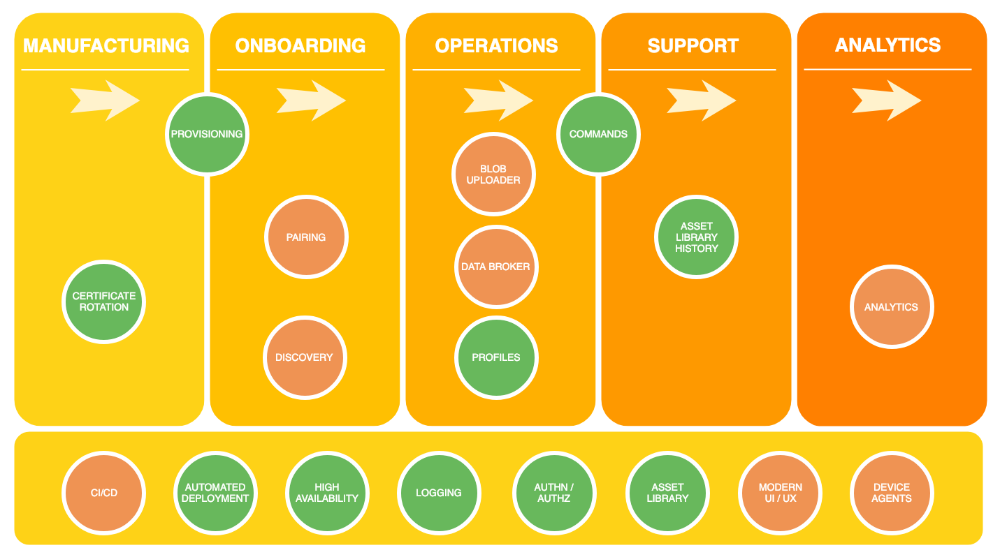
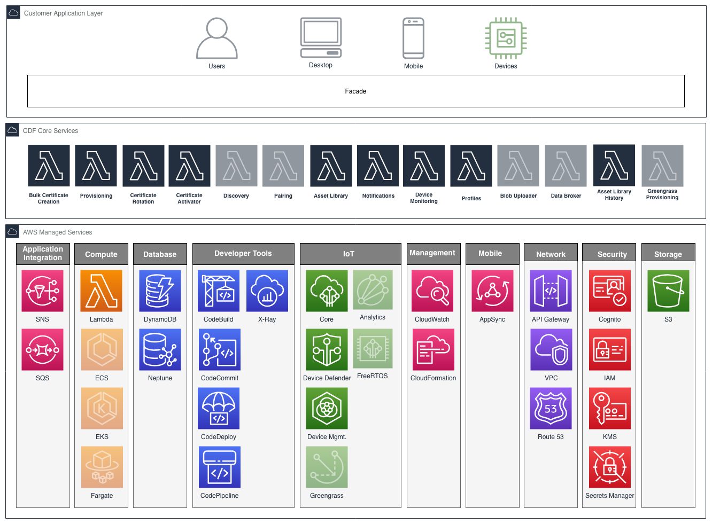

# Connected Device Framework

## Introduction

Managing connected devices involves multiple phases of a device's lifecycle.  The phases a typical connected device goes through are : Product design, Manufacturing, Onboarding, Operations and Support.  In each of these phases, unique set of capabilities are required.  The Connected Device Framework (CDF) provides a set of modular services to cater to connected devices in each of their lifecycle phases.

The framework is particularly well suited for enterprise use cases which require product definition, onboarding and managing a diverse ecosystem of connected devices. The included components facilitate:

* Product template definition
* Provisioning
* Configuration and software update
* Organizing devices into hierarchies
* Maintaining and updating device configuration
* Device command and control
* Offloading device data to blob repository
* Analytics of device data

## Challenges

Implementing, deploying and maintaining IoT services can be significantly more complex than traditional software services due to a number of challenges faced:

**Significant undifferentiated heavy lifting:**  It can take months, if not years, to build out an IoT platform.

**Skills gap:**  Finding product and IoT specialists is one problem, but then needing to find those same people who possess AWS knowledge is significantly harder.

**Bridging historically air-gapped systems:**  Traditionally different areas within a business, such as manufacturing, operations, and support, have been isolated from one another.  Implementing a new IoT service is a once in a generation opportunity to look at the efficiencies of bridging these systems and future proof for growth.

**Limitations with turn-key solutions:**  Off-the-shelf solutions may be opinionated in their implementation such that incompatible limitations are introduced, as well as potential scalability issues.

**Legacy devices:**  There may be an existing population of devices deployed in the wild that need to be transitioned into a new IoT service.

**Complex security requirements:**  Constrained, intermittently connected devices, as well as regional governance, introduce complexity.

**Long term maintainability of software:**  If a software's architecture and implementation does not take into consideration its longevity that comes with unforeseen emerging requirements, its maintainability, scalability and reliability can be significantly impacted as well as a business losing its agility to bring new products and services to market.

The ***Connected Device Framework (CDF)*** is a platform comprising of a number of production ready micro-services, all architected and implemented using software and AWS best practices, which builds upon the AWS IoT building blocks to address these challenges.

## Business Solutions Perspective

The CDF services span the following business solutions:

Legend:  Green:  Implemented, Orange: Outstanding

### Certificate Rotation

The certificate vendor manages the rotation of certificates involving a number of moving parts across CDF and AWS IoT.  The creation and registration of certificates is handled outside this service (refer to cdf-provisioning), with this service focused on securely delivering certificates to devices.  

See [overview](/projects/certificatevendor/overview).

### Provisioning

The provisioning service utilizes [AWS IoT Device Provisioning](https://docs.aws.amazon.com/iot/latest/developerguide/iot-provision.html) to provide both programmatic (just-in-time) and bulk device provisioning capabilities.  The provisioning service simplifies the use of AWS IoT Device Provisioning by allowing for the use of S3 based provisioning templates, and abstracting a standard interface over both device provisioning capabilities.

In addition, the CDF Provisioning Service allows for extending the capabilities of the AWS IoT Device Provisioning templating functionality.  To provide an example, the AWS IoT Device Provisioning allows for creating certificate resources by providing a certificate signing request (CSR), a certificate ID of an existing device certificate, or a device certificate created with a CA certificate registered with AWS IoT.  This service extends these capabilities by also providing the ability to automatically create (and return) new keys and certificates for a device.

See [overview](/projects/provisioning/overview).

### Pairing

*Status:  Not implemented.*

Manages trust between an IoT device, companion mobile device, and user, allowing to perform authorized actions.

### Discovery

*Status:  Not implemented.*

Allows devices to auto-discover the available CDF services, along with identifying the devices own attributes and capabilities.

### Commands

The commands service utilizes [AWS IoT Jobs](https://docs.aws.amazon.com/iot/latest/developerguide/iot-jobs.html) to issue commands to a device or set of devices, and optionally inspect their execution status.  It augments AWS IoT jobs by providing the ability to create Job templates, and enforcing that each requested command adheres to a template before executing.

See [overview](/projects/commands/overview).

### Blob Uploader

*Status:  Not implemented.*

Store and retrieve blob objects.  Provides encryption, ingest, crawling, searching, etc.

### Data Broker

*Status:  Not implemented.*

Allows devices to directly stream data and adds rules for data flowing through IoT to configurable end points.

### Profiles ###

A feature of Asset Library rather than a stand-alone service.  Allows for multiple profiles of default data and relations to be configured and applied to Asset Library devices and groups.

See [overview](/projects/assetlibrary/overview).

### Asset Library History

Tracks and stores all changes made to the Asset Library (devices, groups, policies and/or templates).

See [overview](/projects/assetlibrary-history/overview).

### Analytics

*Status:  Not implemented.*

AWS IoT Analytics.

### CI/CD

*Status:  Not implemented.*

Fully automated Continuous Delivery pipeline, managing the building, testing, and deployment of services.

### Automated Deployment

All services have automated deployment capabilities via CloudFormation.

### High Availability

Allows for capturing CDF actions when an AWS region is not available, and replaying once available again.

See [overview](/projects/request-queue/overview).

### Logging

CloudWatch based logging.

### Authn / Authz

Reference implementations using Cognito, and device certificate custom authorizers.

See [overview](/projects/auth-devicecert/overview).

### Asset Library

The Asset Library service is a device registry that allows one to manage their fleet of devices placed within multiple hierarchical groups.  Each group within a hierarchy can represent something meaningful to your business such as location device types, firmware versions, etc.

See [overview](/projects/assetlibrary/overview).

### Modern UI/UX

*Status:  Not implemented.*

Reference UI/UX implementation.

### Device Agents

*Status:  Not implemented.*

Reference device agents for consuming CDF services.

## Architecture

