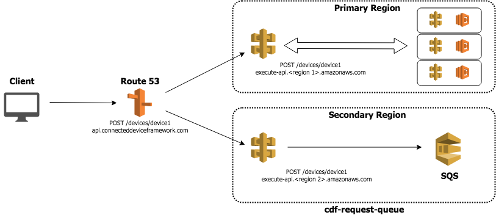

# CDF REQUEST QUEUE

## Introduction

The CDF Request queue project is a service for queueing API requests for later processing. The intention of this service is to be deployed in a secondary AWS region to act as a HA mechanism for the actual API in a primary region. This service involves:

 * API Gateway - a proxy endpoint that proxies requests to the request Lambda function
 * Request Lambda - function which takes incoming API calls and queues them in an SNS FIFI queue
 * Replay Lambda - a function which takes events off of the request queue and tries to replay them to the primary region
 * Request Queue - an SQS FIFO queue which holds the requests until they can be replayed to the primary region
 * DLQ - a dead letter queue which holds any requests which received errors upon trying to replay to the primary region

## Architecture

## Queueing

Requests are queued in SQS as they are recevied by API Gateway. When successfully queued the service responds with an `HTTP 202 - Accepted` response. A configuration item exists to determine which HTTP methods are queued and which are not. Typically a GET request would not make sense to queue. In the case of not queuing the request an `HTTP 503 - Service Unavailable` response is given.

#### Configuration

Config Item | Purpose
---|---
Allowed Methods | HTTP methods which will be queued. Methods not in this list will receive an `HTTP 503 - Service Unavailable` response.

## Replay

Replay is handled by the replay Lambda function. This function can be used as a Lambda or can be a reference implementation on how to replay events. The replay occurs by invoking the primary region's Lambda function directly. Any authorization for the queued call needs to be handled by the request queue API gateway. Once in the queue, the request is assumed to be authorized.

#### Configuration

Config Item | Purpose
---|---
Replay Batch Size | Number of SQS events are retrieved at one time
Lambda Stop Lambda At Remaining Millis | The replay Lambda will continue to process events off of the request queue as long as there are events. It will stop processing with this much time remaining before the Lambda timeout.
Primary Health Check Url | The replay lambda will check this URL to determine if the primary region is available. Now a simplistic check of receiving a 200.
Primary Health Check Response | The expected response from the health check call.
Primary API Lambda Arn | The function ARN of the API Lambda function in the primary region. This is the Lambda function which will be invoked to replay requests.
