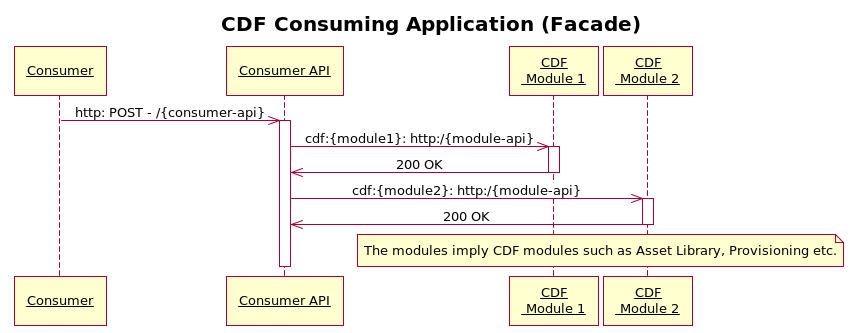

# CDF Consuming Application

## Introduction

CDF consuming applications (aka a facade) is an application or layer that contains customer specific business logic and orchestrates the underlying CDF modules.

The above sequence diagram shows the interaction of the consumer application layer with the cdf modules.

## Deployment

Since the consumer application is dependent on CDF, the consumer application should be deployed after all required CDF modules have been deployed.

