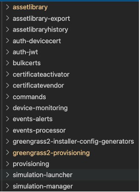
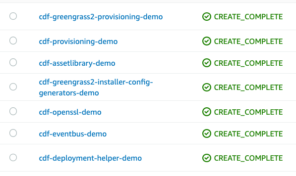

# Deployment Guide
AWS Connected Device Framework(CDF) can be deployed through multiple ways. This deployment guide provides steps by step instruction to deploy CDF through either Mac or Linux environment. Guide make assumption that you operating through IDE environment like Visual Studio, Atom for Cloud9.   

# Environment Prerequisites
Below are environmental dependencies which are required to run this project. 
1. Ensure  you have a Docker CLI installed and running. Please follow the installation instruction below if you do not have Docker CLI.
    Docker Installation:  (https://docs.docker.com/get-docker/)
   
2. Ensure  you have a git client installed. Please follow the installation instruction below if you do not have git client.

    Git Installation:  https://git-scm.com/book/en/v2/Getting-Started-Installing-Git

3. Install NVM: 
	https://github.com/nvm-sh/nvm#installing-and-updating

4. Install Node.js v14 using NVM:
        
        nvm install v14.18.1 
        
        nvm use v14
 
5. Install Rush toll:
	
        npm install -g @microsoft/rush

6. Ensure  you have a AWS CLI(Command Line Interface) installed. Please follow the installation instruction below if you do not have AWS CLI.
    https://docs.aws.amazon.com/cli/latest/userguide/cli-chap-getting-started.html

7. Create Named profile for AWS CLI:
    https://docs.aws.amazon.com/cli/latest/userguide/cli-configure-profiles.html
 		
# CDF Project Prerequisites
1. Clone  the project:            
    a. Create directory for CDF project and navigate terminal to that location before executing below command

    b. git clone https://github.com/aws/aws-connected-device-framework.git

    c. Go to source directory:
        
        cd aws-connected-device-framework/source

2. Setup project prerequisites 

    a.	Setup environment name:  This is environment of project. i.e. Development, Testing, Production  
    
    b.	Assign AWS profile created in step-5 in Environment Prerequisite   
    
    c.	Assign AWS region in which project will be deployed
    
    d.	Assign KMS key name
    
    e.	Assign email address for the project     
        
        export env_name=ENV_NAME
        
        export aws_profile=PROFILE_NAME
    
        export region='REGION'

        export kms_key_owner=$(aws iam get-user --query 'User.UserName' --output text)
       
        export cdf_admin_email=PASTE YOUR EMAIL HERE
        
7. S3 bucket will be used to hold all CDF artifacts.  In console Create S3 bucket(https://s3.console.aws.amazon.com) i.e. cdf-deployment-assetlibrary. 
	
        export s3_bucket_name= BUCKET-NAME

8. EC2 key pair is a set of security credentials that you use to prove your identity when connecting to an Amazon EC2 instance. Below command will create EC2 Keypair that will be used by CDF. 
        
        export keypair_name=${kms_key_owner}_${env_name}_cdf
        
        rm -f ~/.ssh/$keypair_name.pem
        
        aws ec2 create-key-pair \
        --key-name ${keypair_name} \
        --query 'KeyMaterial' \
        --output text >~/.ssh/${keypair_name}.pem
        
        chmod 400 ~/.ssh/${keypair_name}.pem
        
9. Create Configurations: User need to provide configuration which  can be provided at time of deployment via the modules's ENV_NAME-config.json file. If a value is listed, this is the value that is bundled into the application as a default. 

    a.	Create folder “cdf-configurations” file under “source” directory 

    b. Create folder for each required service  under directory “cdf-configurations” i.e. “assetlibrary”.  Note: Make sure name matches service names as show below. Only create folder for services those need to be deployed.

        
        
    b.	Create configuration file under each service folder with name: ENV_NAME-config.json.  (Note: replace ENV_NAME with your environment name) 

    c.	Follow configuration.md inside each service for direction on configuration file. (Location: source>packages>services>SERVICE_NAME>docs)

    e. All mandatory configuration must be provided. If any CDF service does not have manatory configuration please create empty JSON file

10. Install and update rush:
        
        rush install
        
        rush update
        
# CDF Deployment
 
1.	Compile project with rush

        Rush bundle
 
2.	Run Deployment command. This command will deploy necessary CDF stacks  to AWS cloud formation.
a.	Following command deploys asset library lite version + services that has configuration defined:
        
            ./infrastructure/deploy-core.bash -e ENV_NAME \
            -b BUCKET-NAME \
            -p EC2_KEYPAIR_NAME \
            -R REGION \
            -P PROFILE_NAME \
            -y s3://BUCKET-NAME/snippets/ \
            -z cfn-apiGateway-noAuth.yaml \
            -i 0.0.0.0/0 \
            -c <location of config file> \
            -m lite \
            -B
b.	Following command deploys asset library full ** version + services that has configuration defined:
        
            ./infrastructure/deploy-core.bash -e ENV_NAME \
            -b BUCKET-NAME \
            -p EC2_KEYPAIR_NAME \
            -R REGION \
            -P PROFILE_NAME \
            -y s3://BUCKET-NAME/snippets/ \
            -z cfn-apiGateway-noAuth.yaml \
            -i 0.0.0.0/0 \
            -c <location of config file> \
            -m full \
            -B
3.	Deployment will take between up to 15 minutes depending on internet speed.  Once deployment is complete following message will appear on terminal screen.
        
        >>>>>>>>  CDF deployment complete!  <<<<<<<<
	
    Once   deployment is complete you will see all stacks created in cloud formation  in your AWS account.  
    
        

Note: If you do not see this message, please follow instructions for troubleshooting.  

   

