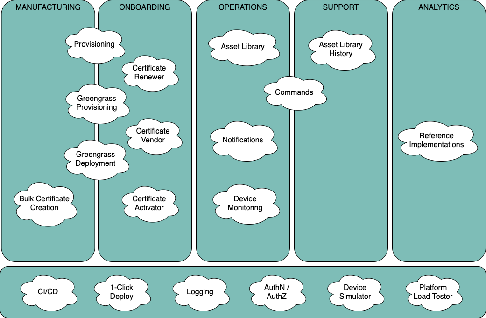

# FAQ

### Q. Is this a new service?

No. AWS Connected Device Framework is not a new service, but a suite of production grade micro-services that a customer can own and deploy to their accounts to help build common device management patterns using AWS services.

### Q. Which core components are available in the AWS Connected Device Framework?

AWS Connected Device Framework currently includes the following set of components across various device lifecycle stages.

 

### Q. What features are included in the AWS Connected Device Framework?

The current release offers the following:

- Secure bulk certificate creation
- Flexible device provisioning
- Greengrass bulk provisioning
- Automated Greengrass device installation and configuration
- Expiring certificate detection
- Certificate vending
- Asset management, as well as auditing capabilities
- Real-time notifications via email, SMS and/or mobile push
- Device connectivity tracking
- OTA flows
- Reference CI/CD pipelines including automated integration testing
- Device simulation, as well as platform load testing tools
- Various authentication / authorization methods supported

### Q. How is this different from what I can do today?

AWS Connected Device Framework takes an opinionated approach to implementing the above listed features. This helps you get up and running quickly. If these features are not an exact match for what you want, you can always customize the framework through well-defined interfaces. In the current version, you may customize Authentication and Authorization provider, device onboarding workflow, device metadata, asset data, and OTA. If customization also does not meet your needs, you can extend the base framework at well-defined extension points to implement functionality to suit your need.

### Q. Can I modify the framework and use it in my applications?

Yes, you may modify the framework. We encourage customers to contribute enhancements to the framework.
### Q. What is the pricing structure for AWS Connected Device Framework?

There is no additional charge for AWS Connected Device Framework. However, you will be charged for usage of underlying AWS services as per the published pricing for those services.

### Q. What are the software components of the AWS Connected Device Framework?

The AWS CDF is comprised of the following micro-services:

- Bulk certs
- Provisioning
- Greengrass provisioning
- Greengrass deployment
- Certificate renewal
- Certificate vendor
- Certificate activator
- Asset Library
- Asset Library history
- Notifications
- Device Monitoring
- Commands
- Device Simulator
- Platform load tester

### Q. What authentication and authorization mechanisms are supported by the framework?

Devices interacting with AWS CDF over MQTT are authenticated via X.509 certificates. Devices and/or users interacting with AWS CDF over HTTPS may use Cognito, Lambda request authorizers, Lambda token authorizers, IAM, API key, or private API gateways.

In addition, the Asset Library supports a fine-grained access control method to allow for granular authorization management such as in multi-tenant scenarios.

### Q. I have unique requirements for device onboarding requiring specific activities to be performed during this phase. How can I leverage AWS Connected Device Framework?

The Provisioning component included in the framework does not impose any specific activity and allows you to specify a custom workflow of onboarding activities. With this approach, you can completely customize the activities which need to be carried out during device onboarding

### Q. How scalable and fault tolerant is AWS Connected Device Framework?

The framework is built on native AWS services. The provided references applications are built on the serverless paradigm making it highly scalable and fault tolerant. You can customize this application to create your own highly scalable application. If you make any changes to underlying services, please follow the AWS best practices to ensure high availability and scalability.

