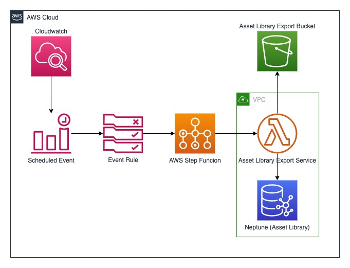
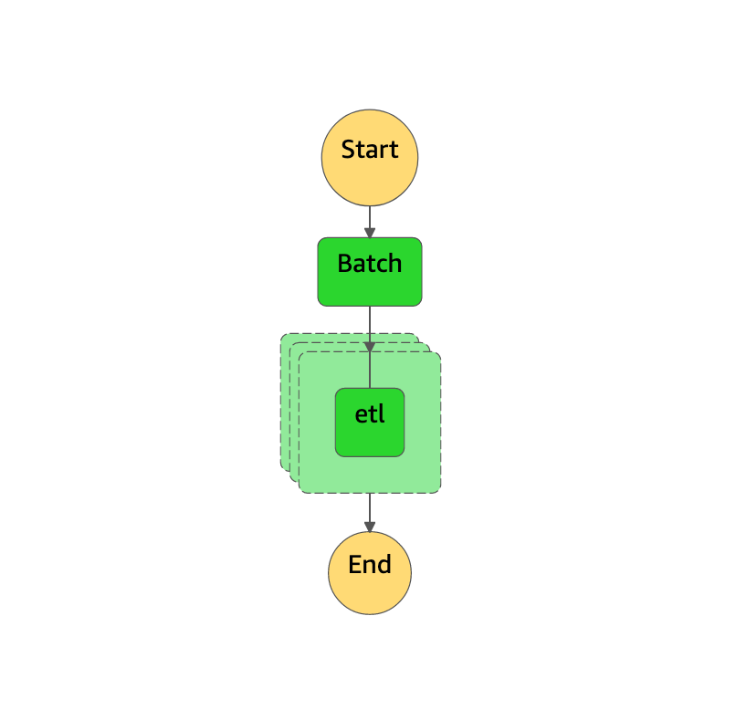
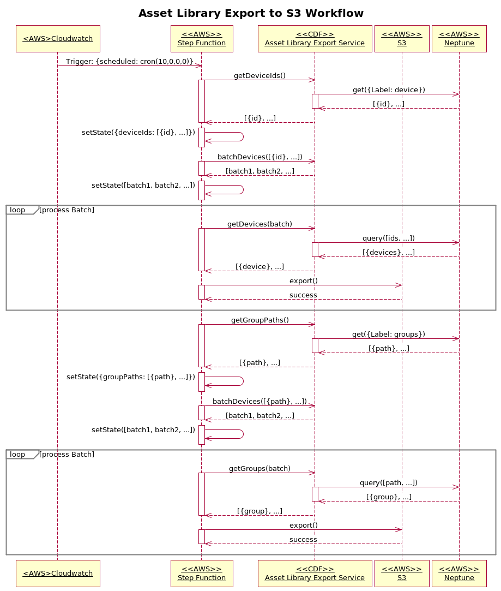

# ASSET LIBRARY EXPORT DESIGN

## High Level Architecture

The below diagram represents the high-level overview from the infrastructure perspective

## Step function State Machine Architecture

The following state machine diagram shows the different state transitions involved

## Sequence Diagram

The below sequence diagram can be referenced to understand the module level interaction for the export workflow

