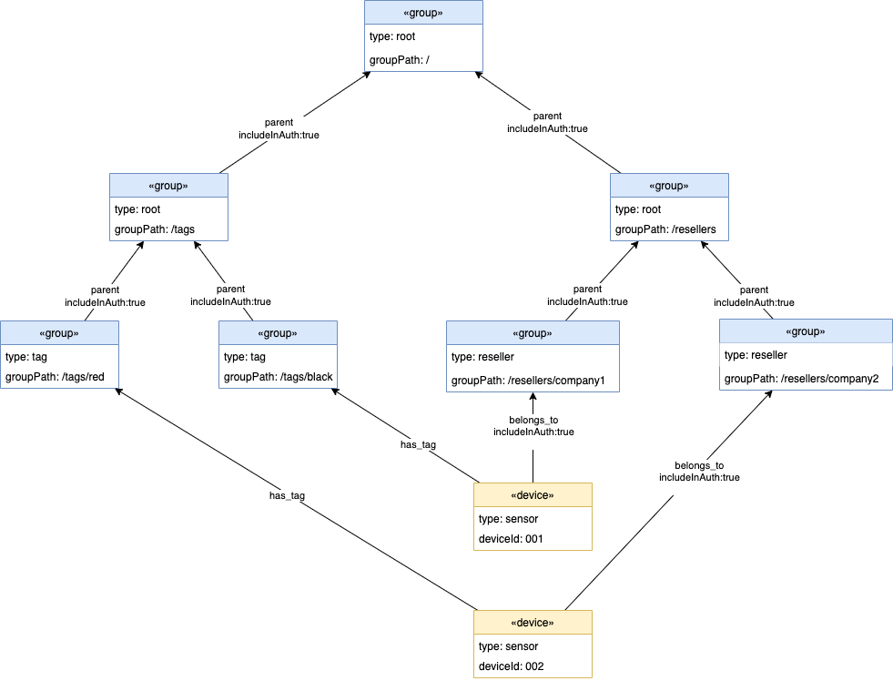

# ASSET LIBRARY FINE-GRAINED ACCESS CONTROL

## Introduction

Enabling fine-grained access control (FGAC) mode within the CDF Asset Library allows for controlling granular permissions at the device/group level based on a user's allowed access levels. Note that FGAC is available in the _full_ (graph) mode only.

A user’s allowed access to group hierarchies, and their allowed operations on these hierarchies, is managed via an external IdP (such as Cognito). When a user signs into the IdP, and a JWT auth token is generated, a custom claim `cdf_al` needs to be added to the JWT which specifies the user's allowed access. The Asset Library will enforce that the user is only able to interact with the devices/groups that belong to the group hierarchies as defined in the JWT custom claim.

## Configuration

As mentioned in the introduction, a JWT is required to be created by an IdP and passed to the Asset Library as the `Authorization` http header. It is recommended that a Lambda authorizer be deployed to validate the JWT token. The `auth-jwt` reference project may be used for this.

To enable FGAC, the Asset Library `AUTHORIZATION_ENABLED` configuration property should be set to `true`.

When `AUTHORIZATION_ENABLED` is set to `true`, this also automatically sets `DEFAULTS_GROUPS_VALIDATEALLOWEDPARENTPATHS` to `true`. This means that allowed `parent` relations will need to be defined on group types including updating the built-in `root` group category.

## Asset Library Data Model Design

When enabling FGAC, a user's access to a particular device and/or group is based on what outgoing relations that have been marked as to be included in auth checks can be traversed until a group path is found that the user's JWT has granted access. Let's take the following example:



In this example we have a group hierarchy (`/resellers`) containing 2 groups: `/resellers/company1` and `/resellers/company2`. Each of those reseller groups has associated with them 1 device each via the `belongs_to` relationship (`/resellers/company1` has device `001` and `/resellers/company2` has device `002`). There is a second hierarchy `/tags` which represents the tags `/tags/red` and `/tags/black`. The device are associated with the tag hierarchy via the `has_tag` relation, allowing for searching for devices via tags.

All the relations in the example above with the exception of the `has_tag` relation between a device and tag group have the relation property `includeInAuth` set to `true`. This identifies these specific relations as being used to identify whether a user is authorized to the device/group. As an example, if someone is trying to access device `001` either by querying the device directly, querying what is related to `/resellers/company1`, querying what is related to `/tags/black`, or performing a search, it will traverse all outgoing relations from the device that have been marked as `includeInAuth` set to `true` and collect those group paths. In this example it will find the group paths `/resellers/company1`, `/resellers`, and finally `/`. It is these group paths that are cross referenced with the group paths provided as part of the `cdf_al` claim of the users JWT to determine whether access is granted.

Let's say we have the following 3 users:

- User `Lee` requires read only access to devices that belong to `/resellers/company1` - device `001`
- User `Stewart` requires write access to devices that belong to `/resellers/company2` - device `002`
- User `Sarah` is an admin who required full access to everything - both devices `001` and `002`

We want all users to be able to filter using the `/tags` hierarchy, but to only return devices that the have access to via the `/resellers` hierarchy. To accomplish this, we define the users `cdf_al` custom claim in their JWT as follows:

| User      | `cdf_al` custom claim                  |
| --------- | -------------------------------------- |
| `Lee`     | `["/tags:R", "/resellers/company1:R"]` |
| `Stewart` | `["/tags:R", "/resellers/company2:*"]` |
| `Sarah`   | `["/:*"]`                              |

Here would be the results of various calls made by those users:

**Retrieve device `001` via `GET /devices/001`**

| User      | Result                  |
| --------- | ----------------------- |
| `Lee`     | 200 (OK) - device `001` |
| `Stewart` | 403 (Not authorized)    |
| `Sarah`   | 200 (OK) - device `001` |

**Updating device `001` via `PATCH /devices/001`**

| User      | Result               |
| --------- | -------------------- |
| `Lee`     | 403 (Not authorized) |
| `Stewart` | 403 (Not authorized) |
| `Sarah`   | 204 (No body)        |

**Updating device `002` via `PATCH /devices/002`**

| User      | Result               |
| --------- | -------------------- |
| `Lee`     | 403 (Not authorized) |
| `Stewart` | 204 (No body)        |
| `Sarah`   | 204 (No body)        |

**Listing all devices via `GET /search?type=device`**

| User      | Result                             |
| --------- | ---------------------------------- |
| `Lee`     | 200 (OK) - device `001`            |
| `Stewart` | 200 (OK) - device `002`            |
| `Sarah`   | 200 (OK) - devices `001` and `002` |

**Listing all device associated with the tag `/tags/red` via `GET /groups/%2ftags%2fred/members/devices`**

| User      | Result                  |
| --------- | ----------------------- |
| `Lee`     | 200 (OK) - no results   |
| `Stewart` | 200 (OK) - device `002` |
| `Sarah`   | 200 (OK) - device `002` |

**Retrieving the `company2` groups via `GET /groups/%2fresellers%2fcompany2`**

| User      | Result                                 |
| --------- | -------------------------------------- |
| `Lee`     | 403 (Not authorized)                   |
| `Stewart` | 200 (OK) - group `/resellers/company2` |
| `Sarah`   | 200 (OK) - group `/resellers/company2` |

**Creating new `company3` group via `POST /groups`**

| User      | Result               |
| --------- | -------------------- |
| `Lee`     | 403 (Not authorized) |
| `Stewart` | 403 (Not authorized) |
| `Sarah`   | 201 (Created)        |

## Asset Library Data Model Implementation

When defining types (aka templates), in order to mark a relation between 2 group/device types as to be included in auth checks, set the relations `includeInAuth` property to `true`. The creation of the device/group types in the example above would be as follows:

**Update the built-in `root` group category to support defining a recursive `parent` relation that is part of auth checks:**

```json
PATCH /templates/group/root
Accept: application/vnd.aws-cdf-v2.0+json
Content-Type: application/vnd.aws-cdf-v2.0+json

{
    "properties": {},
    "relations": {
        "out": {
            "parent": [{
                "name": "root",
                "includeInAuth": true
            }]
        }
    },
    "required": []
}
```

**Create new `tag` group category defining an outgoing `parent` relation to `root` that is part of auth checks:**

```json
POST /templates/group/tag
Accept: application/vnd.aws-cdf-v2.0+json
Content-Type: application/vnd.aws-cdf-v2.0+json

{
    "properties": {},
    "relations": {
        "out": {
            "parent": [{
                "name": "root",
                "includeInAuth": true
            }]
        }
    },
    "required": []
}
```

**Create new `reseller` group category defining an outgoing `parent` relation to `root` that is part of auth checks:**

```json
POST /templates/group/reseller
Accept: application/vnd.aws-cdf-v2.0+json
Content-Type: application/vnd.aws-cdf-v2.0+json

{
    "properties": {},
    "relations": {
        "out": {
            "parent": [{
                "name": "root",
                "includeInAuth": true
            }]
        }
    },
    "required": []
}
```

**Create new `sensor` device category defining an outgoing `belongs_to` relation to `reseller` that is part of auth checks, and an outgoing `has_tag` relation to `tag` that is not part of auth checks:**

```json
POST /templates/group/reseller
Accept: application/vnd.aws-cdf-v2.0+json
Content-Type: application/vnd.aws-cdf-v2.0+json

{
    "properties": {},
    "relations": {
        "out": {
            "belongs_to": [{
                "name": "reseller",
                "includeInAuth": true
            }],
            "has_tag": ["tag"]
        }
    },
    "required": []
}
```

### More information regarding the external IdP configuration

The external IdP should allow for the configuring of claims by specifying a group path along with allowed operations. The following represent example custom claims where the claim key is `cdf_al`, and the claim value is an array of group paths along with allowed claim access levels: `C`reate, `R`ead, `U`pdate, `D`elete, or ’\*‘ as a shortcut for full privileges:

Note that as JWT custom claims only support strings, not arrays, the value of the `cdf_al` custom claim needs to be a stringified version of the array as follows:

| User      | `cdf_al` custom claim                  | stringified `cdf_al`                         |
| --------- | -------------------------------------- | -------------------------------------------- |
| `Lee`     | `["/tags:R", "/resellers/company1:R"]` | `"[\"/tags:R\", \"/resellers/company1:R\"]"` |
| `Stewart` | `["/tags:R", "/resellers/company2:*"]` | `"[\"/tags:R\", \"/resellers/company2:*\"]"` |
| `Sarah`   | `["/:*"]`                              | `"[\"/:*\"]"`                                |

An example (decrypted) JWT payload generated by the IdP including the custom claims would be:

```json
{
  "iss": "Some IdP",
  "iat": 1570654016,
  "exp": 1602190016,
  "cdf_al": "[\"/tags:R\", \"/resellers/company2:*\"]"
}
```
