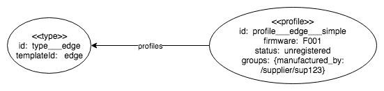

# ASSET LIBRARY:  Profiles

## Introduction

A _profile_ represents a set of default values and/or relations that may be applied to an instance of a specific device/group.

## Managing Profiles

The following endpoints are provided to manage profiles:

Endpoint | Description
---|---
`POST /profiles/[device|group]/{template}` | Creates a new profile
`PATCH /profiles/[device|group]/{template}/{name}` | Updates an existing profile
`GET /profiles/[device|group]/{template}/{name}` | Retrieves a specific profile
`DELETE /profiles/[device|group]/{template}/{name}` | Deletes a specific profile
`GET /profiles/[device|group]/{template}` | Returns all profiles of a given template

An example of a device profile resource:

```json
{
	"profileId": "simple",
	"templateId": "edge",
    "groups": {
        "manufactured_by": ["/supplier/sup123"]
    },
    "attributes": {
        "firmware": "F001",
        "status": "unregistered"
    }
}
```

An example of a group profile resource:

```json
{
	"profileId": "simple",
	"templateId": "engine",
	"parentPath": "/engine",
	"attributes": {
        "location": "west"
	}
}
```

When creating/updating device/group profiles, their attributes/relations are validated against the schema of the provided template.

## Applying Profiles

The following endponts allow for applying profiles to a device/group by providing the `?applyProfile` query string parameter:

Endpoint | Description
---|---
`POST /devices?applyProfile=` | Creates a new device
`PATCH /devices/{deviceId}?applyProfile=` | Updates an existing device
`POST /bulkdevices?applyProfile=` | Creates a set of device
`PATCH /bulkdevices/{deviceId}?applyProfile=` | Updates a set of existing device
`POST /groups?applyProfile=` | Creates a new group
`PATCH /groups/{gorupPath}?applyProfile=` | Updates an existing group
`POST /bulkgroups?applyProfile=` | Creates a  new group

In the case of creating new devices/groups, when applying a profile the values of the profile are applied to the device/group first before applying any explicit provided attributes.

In the case of updating existing devices/groups, the same logic as above is applied with the exception that the attributes of the profile are only applied to the device/group whose attribute is not already set.  Profile relations, in contrast, are always applied by appending to the device/groups existing relations.

Once a profile has been applied, the attributes and relations of the merged device/group are validated against its template.

## Database Structure

Profiles behave similar to device/group instances such that a vertex represents a profile of a given template, with attributes and relations conforming to the template.  The exception, what differs them from devices/groups, is that profiles have the label `profile` allowing for inclusion/exclusion from queries as needed.

