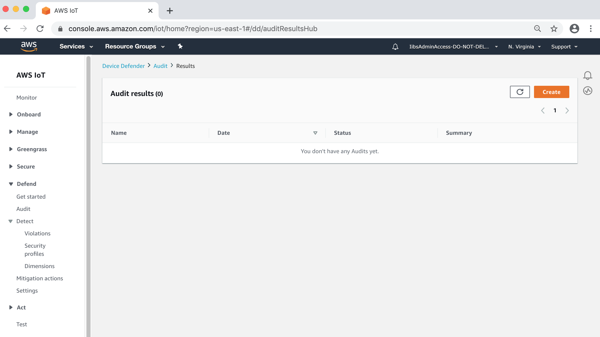
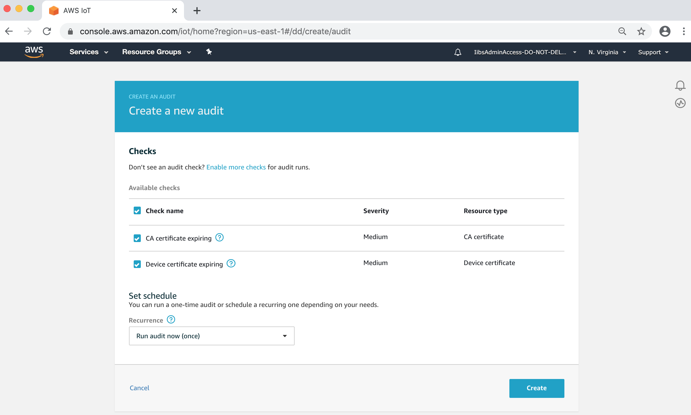
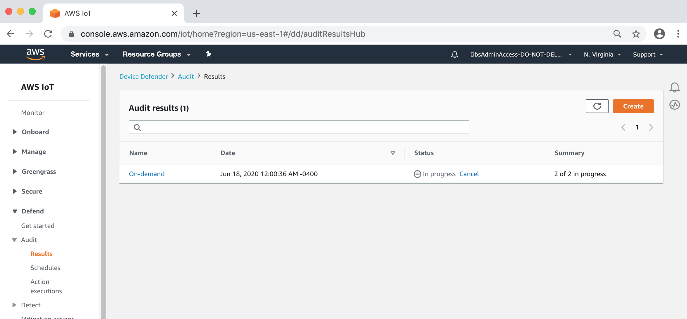
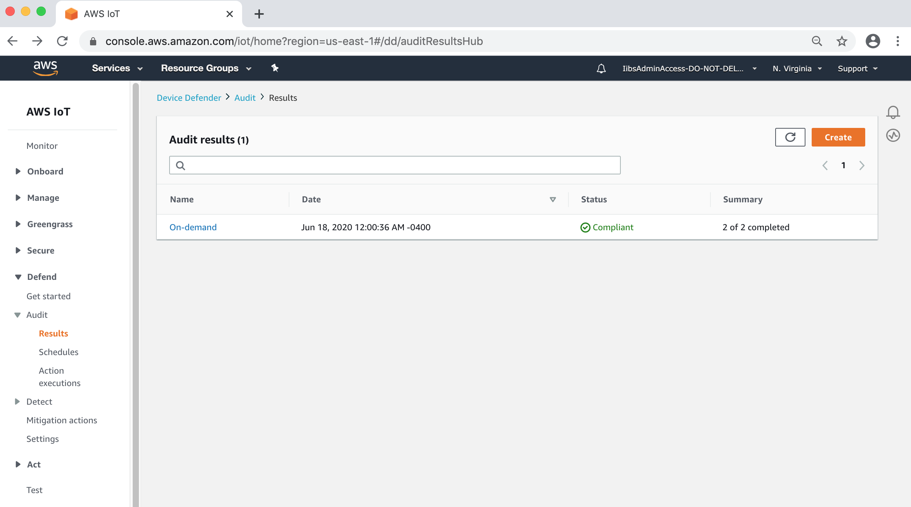
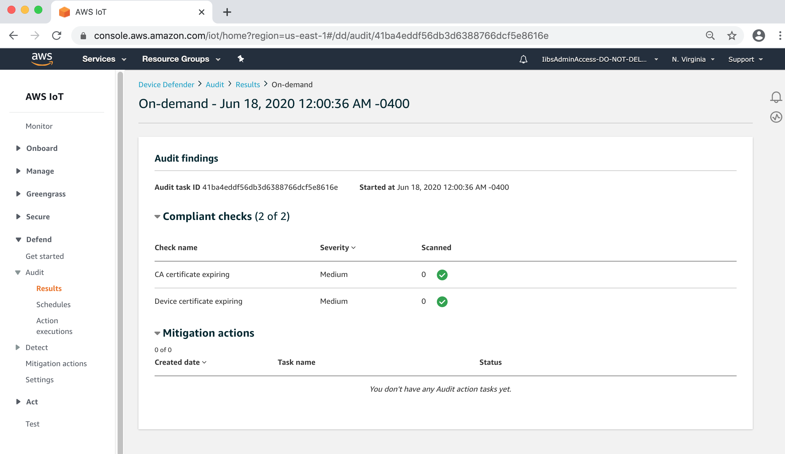
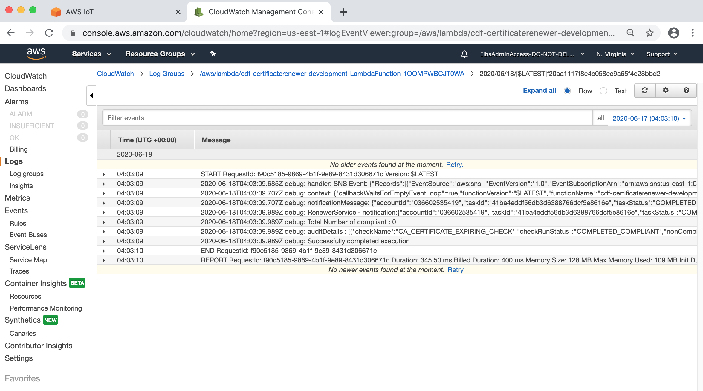

# CERTIFICATE RENEWER

## Introduction

The CDF Certificate renewer service utilizes AWS Iot Device Defender audit feature to monitor audit findings and send audit event to the SNS topic, that is then picked by the certificate renewer lambda for processing. Before the certificate renewal this service validate if the device is active from Asset Library. By default, Asset Library validation will be disabled.
If you want to deploy the complete CDF Core framework, Please refer to [this cdf document](http://cdf-xxxxxxxxxxxx-us-west-2-docs.s3-website-us-west-2.amazonaws.com/advanced/index.html)

## Steps to Deploy the solution:
You will walk through a solution which has the following tasks:

- Create S3 bucket to store config and certificates.
- Build the CDF Certificate renewer solution
- Package the CDF Certificate renewer solution.
- Deploy the CDF Certificate renewer solution.
- Run an on-demand audit.
- Monitor the progress of the audit result.
- Validate cloud watch log.
- Validate the certificate stored in S3 bucket.

## Create S3 bucket to store config and certificates
```sh
aws s3 mb s3://<MY_CONFIG_BUCKET> --region <AWS_REGION> --profile <AWS_PROFILE> 
```

## Clean node packages and re-install
```sh
pnpm run reset
```

## Install packages and it's dependencies
```sh
pnpm install --force
```

## Bundle project packages
```sh
./infrastructure/bundle-core.bash 
```

## Package the CDF solution.
```sh
./infrastructure/package-core.bash -b <MY_CONFIG_BUCKET> -R <AWS_REGION> -P <AWS_PROFILE>

```
## Deploy the CDF Certificate renewer solution 
```sh
./infrastructure/deploy-core.bash -e development -b <MY_CONFIG_BUCKET> -R <AWS_REGION> -P <AWS_PROFILE>

```

## Navigate to the Audit results 
* Navigate to AWS IoT -> Defend -> Audit -> Results

 

## Create on demand audit 
* Navigate to AWS IoT -> Defend -> Audit -> Results -> Create

 

## Verify the IoT Audit on-demand job running status
* Navigate to AWS IoT -> Defend -> Audit -> Results

 
 
## IoT Audit execution completed
* Navigate to AWS IoT -> Defend -> Audit -> Results

 

## Review IoT Audit Results
* Navigate to AWS IoT -> Defend -> Audit -> Results

 
 
## Verify the CloudWatch log
* Navigate to AWS CloudWatch -> Logs -> Log groups
* AWS Lambdas allows you to integrate with CloudWatch for centralized logging. Please refer - [Amazon CloudWatch](https://aws.amazon.com/cloudwatch/)

 

## Verify the S3 bucket
* The renewed certificate should be stored within S3 bucket. 

## Conclusion

By using AWS IoT Device Defender, customers can perform a regular audit to avoid security issues on their AWS IoT account. AWS IoT Device Defender supports both scheduled and on demand audits. 
This audit helps customers to address security concern before they occurred.  The current solution helps to identify AWS IoT certificates that are expiring or expired in the AWS customer account and automatically creates replacement certificate before renewing to the physical devices.  

## What have we accomplished
* Build the CDK certificate re-newer solution.
* Deployed CDK Certificate re-newer solution that include services such as Cloud formation, Amazon SNS, AWS Lambda, SQS, S3, DynamoDB used for processing.
* Run an on-demand audit.
* Monitor the progress of the audit.
* Validate the CloudWatch log.
// FIXME: This text aboves references cdk solution, is this true?