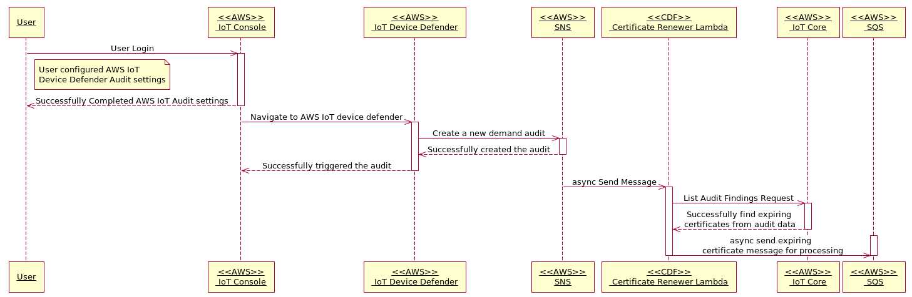
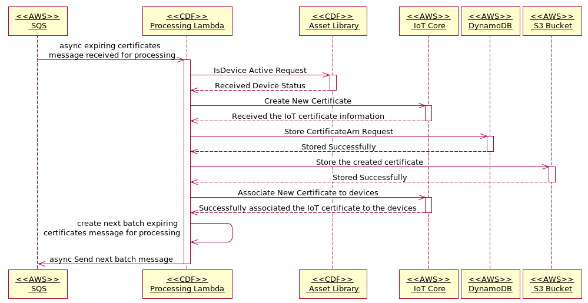

# Certificate Renewer: Design

The CDF Certificate Renewer service has two lambdas, that are responsible for processing certificate expiring alert received from device defender.
- CDF Certificate Renewer
- CDF Certificate Processor 

## High Level Architecture
 

## AWS IoT Certificate Renewer Flow - Sequence diagram
 

## AWS IoT Certificate Processor Flow - Sequence diagram
 