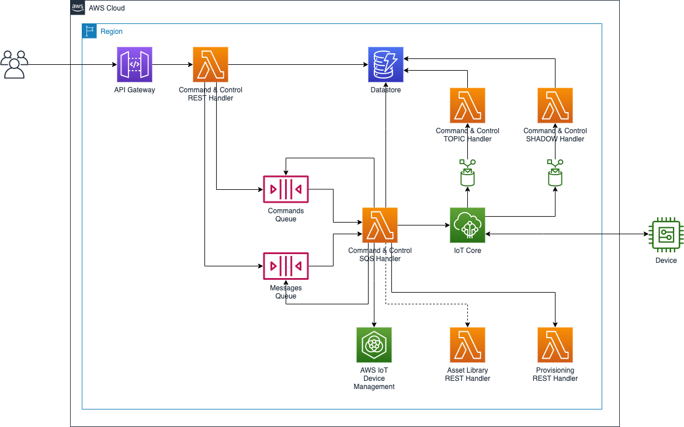

# COMMAND AND CONTROL

## Introduction

In IoT applications, commands are used to control a device remotely and to acknowledge successful command executions. Commands can be a back and forth workflow that can occur between two devices or between the cloud and devices.

Several services are available for you to implement command and control operations on AWS IoT. With the capability to store the desired and reported states in the cloud, the AWS IoT Shadow is the preferred AWS IoT service for implementing individual device commands. AWS IoT Device Jobs should be used for fleet-wide operations as it provides extra benefits, such as Amazon CloudWatch metrics for Job tracking, and the ability to track multiple in-transit Jobs for a single device.

For any given IoT deployment, you may need to use a combination of the AWS IoT Shadow, AWS IoT Jobs, and standard MQTT topics to support your command use cases. This can require a significant implementation effort!

This module provides a simple zero-code approach to implement command and control functionality using AWS IoT Shadows, AWS IoT Jobs, and/or MQTT topics as desired. In addition, it supports sending to a variety of different targets regardless of the delivery method configured: a thing or list of things, a thing group or list of thing groups, a dynamic group or list of dynamic groups, an Asset Library device or list of devices, an Asset Library group or list of groups, an Asset Library search query, or any combination of.

Finally, any messages sent back from the device related to the command message are correlated to the original message where the entire conversation can be easily retrieved.

## REST API

Refer to the [Swagger](docs/swagger.yml) for a detailed list of the available REST API endpoints.

## Walkthrough

The following walkthroughs give examples of how to configure commands sent vis MQTT topics, via AWS IoT Device Shadows, and via AWS IoT Jobs. Even though the definition of each command is slightly different, what is important is that the way the messages are sent, the way the messages are received, the way recipients are listed, and the way replies are listed, is consistent across all three methods.

### Example 1: Send a reboot command to a single device via an MQTT topic

Here we define the `reboot` command operation which we can use to send a `reboot` message to a device. It has no payload, expects no reply, and is sent via an MQTT topic:

#### REQUEST

```json
POST /commands

Headers: 
  Accept: application/vnd.aws-cdf-v1.0+json
  Content-Type: application/vnd.aws-cdf-v1.0+json

Body:
{
    "operation": "reboot",
    "deliveryMethod": {
        "type": "TOPIC",
        "onlineOnly": true
    }
}
```

#### RESPONSE

```json
Headers:
  location: /commands/yt4xx5nhm
  x-commandid: yt4xx5nhm
```

Once a command has been defined, a message for that command may be sent to the device:

#### REQUEST

```json
POST /commands/yt4xx5nhm/messages

Headers:
  Accept: application/vnd.aws-cdf-v1.0+json
  Content-Type: application/vnd.aws-cdf-v1.0+json

Body:
{
    "targets": {
        "awsIoT": {
            "thingNames": [ "my-thing-1" ]
        }
    }
}
```

#### RESPONSE

```json
Headers:
  location: /messages/nbq0rfylz
  x-messageid: nbq0rfylz
```

The combination of provided things, thing groups, Asset Library devices, Asset Library groups, and Asset Library search queries that make up the provided message `targets` are expanded to obtain a list of thing names. An MQTT message is sent to each thing of that list as follows. 

```mqtt
Topic: cmd/cdf/cac/<thingName>/<correlationId>/+

Payload:
{
  "operation": "reboot",
  "correlationId": "<correlationId">,
  "topics": {
    "accepted": "cmd/cdf/cac/<thingName>/<correlationId>/accepted",
    "rejected": "cmd/cdf/cac/<thingName>/<correlationId>/rejected",
  }
  "payload": { 
    // optional payload
  }
}
```

Notes about the above MQTT message:
- Each device intended to listen to MQTT topic based commands should subscribe to `cmd/cdf/cac/<thingName>/+` to receive the messages
- The value of `operation` is set to what was provided as the `operation` when creating the command. Devices should key off this attribute to determine what to do
- The provided `<correlationId>` is unique to each device and message, and is what correlates all responses back to the original message
- In this example we did not provide a payload when creating the command, therefore an empty payload is sent
- If a device chooses to proceed with the command, it should send an empty message to the topic provided as `topics.accepted`. Likewise, if it decides to reject the command, it should send an empty message to the topic provided as `topics.rejected`
- If the command had been initially configured with `deliveryMethod.expectReply` set to `true`, then a topic provided as `topics.reply` in the message should be used to send any replies

When responding to the message using the provided `topics.accepted|rejected|reply` topics, the payload should be formatted as follows:

```mqtt
Topic: cmd/cdf/cac/<thingName>/<correlationId>/reply

Payload:
{
  "payload": { 
    "status": "success"
  },
  "timestamp": 1646674865
}
```


### Example 2: Request all devices that are a member of a group to publish stats via their Device Shadow

Here we define the `stats` command operation which we can use to send a `stats` message to a device. This example is configured to send the command via a device shadow, sends a payload with the command that requires values providing for predefined parameters, and expects a reply.

#### REQUEST

```json
POST /commands

Headers: 
  Accept: application/vnd.aws-cdf-v1.0+json
  Content-Type: application/vnd.aws-cdf-v1.0+json

Body:
{
    "operation": "stats",
    "deliveryMethod": {
        "type": "SHADOW",
        "expectReply": true
    },
    "payloadTemplate": "{\"level\": \"${level}\"}",
    "payloadParams": ["level"]
}
```

#### RESPONSE

```json
Headers:
  location: /commands/yt4xx5nhm
  x-commandid: yt4xx5nhm
```

Once the command has been defined, a message may be sent. In this example we are sending the command message to a thing group. As we defined a payload along with parameters, we provide the values for the parameters when creating the message:

#### REQUEST

```json
POST /commands/yt4xx5nhm/messages

Headers:
  Accept: application/vnd.aws-cdf-v1.0+json
  Content-Type: application/vnd.aws-cdf-v1.0+json

Body:
{
    "targets": {
        "awsIoT": {
            "thingGroupNames": [ "my-group-1" ]
        }
    }, 
    "payloadParamValues": {
        "level": "high"
    }
}
```

#### RESPONSE

```json
Headers:
  location: /messages/nbq0rfylz
  x-messageid: nbq0rfylz
```

As in example 1, the message targets are expanded to obtain a list of thing names. However, as this command is configured with a `deliveryMethod.type` of `SHADOW`, the command is set via the named shadow `cac` of the device. An example of the named device shadow is as follows:

```json
{
  "state": {
    "desired": {
      "stats": {
        "level": "high"
      }
    },
    "clientToken": "<correlationId>"
  }
}
```

Notes about the above device shadow:
- The `command.operation` is added as a new field to `state.desired`, with its value being a stringified version of the expanded `command.payload`
- Devices should key off the `state.desired.[operation]` field as to determine how to process the command
- The `clientToken` is set to the correlationId that is unique to this message and device

When replying via a shadow, the device should perform the following steps when updating the shadow:
  - Removing the operation from the `state.desired` section by setting its values to `null`
  - Adding the operation name as a key to the `state.reported` section
  - The `state.reported.[operation]` field should be set to a json object containing `timestamp`, `action` (`accepted`, `rejected`, or `reply`), and `payload`
  - Setting the `clientId` to that what was originally provided so that the changes to the device shadow are correlated to the original message

An example of sending a reply from the device via the device shadow is as follows:

```mqtt
Topic: $aws/things/<thingName>/shadow/name/cac/update

{
  "state": {
    "desired": {
      "stats": null
    },
    "reported": {
      "stats": {
      	"timestamp": 1646674865,
      	"action": "reply",
      	"payload": {
          "level": "high"
        }
      }
    }
  },
  "clientToken": "<correlationId>"
}
```

As the command targets comprised a thing group, we can use the following REST endpoint to retrieve the list of recipients the message was send to:

#### REQUEST

```json
GET /messages/nbq0rfylz/recipients

Headers: 
  Accept: application/vnd.aws-cdf-v1.0+json
  Content-Type: application/vnd.aws-cdf-v1.0+json

```

#### RESPONSE

```json
Body:
{
  "recipients": [
    {
      "thingName": "my-thing-1",
      "statusId": "pending",
      "correlationId": "abc123"
    }, {
      "thingName": "my-thing-2",
      "statusId": "success",
      "correlationId": "abc123"
    }
  ]
}
```

We can go one step further and retrieve all replies associated ith a specific recipient:

#### REQUEST

```json
GET /messages/nbq0rfylz/recipients/my-thing-1/replies

Headers: 
  Accept: application/vnd.aws-cdf-v1.0+json
  Content-Type: application/vnd.aws-cdf-v1.0+json

```

#### RESPONSE

```json
Body:
{
  "replies": [
    {
      "receivedAt": "2022-01-31T14:48:00.000Z",
      "action": "reply",
      "payload": {
        "cpu":54
      }
    }, {
      "receivedAt": "2022-01-31T14:49:00.000Z",
      "action": "reply",
      "payload": {
        "cpu":32
      }
    }, {
      "receivedAt": "2022-01-31T14:50:00.000Z",
      "action": "reply",
      "payload": {
        "cpu":12
      }
    }
  ]
}
```


### Example 3: Target devices via an Asset Library query to rotate and publish logs, using AWS IoT Jobs so that rollout of the command can be controlled

Here we define the `update_firmware` command operation which we can use to send a `update_firmware` message to a device. Its payload has a presigned s3 url to the firmware image to be downloaded. Note that in this example we are setting all the optional `deliveryMethod.jobExecutionRolloutConfig`, `deliveryMethod.abortConfig`, and `deliveryMethod.timeoutConfig` settings to further customize the rollout of the command via AWS IoT Jobs.

#### REQUEST

```json
POST /commands

Headers: 
  Accept: application/vnd.aws-cdf-v1.0+json
  Content-Type: application/vnd.aws-cdf-v1.0+json

Body:
{
    "operation": "rotate_logs",
    "deliveryMethod": {
        "type": "JOB",
        "expectReply": true,
        "presignedUrlConfig": {
            "expiresInSec": 3600
        },
        "jobExecutionsRolloutConfig": {
            "maximumPerMinute": 50,
            "exponentialRate": {
                "baseRatePerMinute": 20,
                "incrementFactor": 2,
                "rateIncreaseCriteria": {
                  "numberOfNotifiedThings": 1000
                }
            }
        },
        "abortConfig": {
            "criteriaList": [
                {
                    "action": "CANCEL",
                    "failureType": "FAILED",
                    "minNumberOfExecutedThings": 100,
                    "thresholdPercentage": 20
                }
            ]
        },
        "timeoutConfig": {
            "inProgressTimeoutInMinutes": 100
        }
    },
    "payloadTemplate": "{\"firmwareLocation\": \"${aws:iot:s3-presigned-url:https://s3.region.amazonaws.com/bucket/firmware/123.zip}\"}",
}
```

#### RESPONSE

```json
Headers:
  location: /commands/yt4xx5nhm
  x-commandid: yt4xx5nhm
```

Once the command has been defined, a message for that command may be sent to the device. For the sake of providing different examples for the walkthroughs, here we are using the optional Asset Library integration to use an Asset Library search query (all lightbulbs running a specific firmware version located in Colorado) as the target of the command:

#### REQUEST

```json
POST /commands/yt4xx5nhm/messages

Headers:
  Accept: application/vnd.aws-cdf-v1.0+json
  Content-Type: application/vnd.aws-cdf-v1.0+json

Body:
{
    "targets": {
        "assetLibrary": {
            "query": {
                "ancestorPath": "/devices/lightbulbs/color",
                "eq": [
                    {
                        "field": "firmware",
                        "value": "1.1.23"
                    },
                    {
                        "traversals": [
                            {
                                "relation": "located_at",
                                "direction": "out"
                            }
                        ],
                        "field": "name",
                        "value": "Colorado"
                    }
                ]
            }
        }
    }
}
```

#### RESPONSE

```json
Headers:
  location: /messages/nbq0rfylz
  x-messageid: nbq0rfylz
```

As part of sending this message, a job document is created using the defined payload which includes the generation of a pre-signed S3 url to download the firmware. An AWS IoT Job is created using the job execution rollout config, abort config, and timeout config provided as part of the command. The devices will act upon the action, then update the job execution result once complete. An IoT rule is in place to monitor the replies which once received is associated with the original request.

As was described in _example 2_, the `GET /messages/<messageId>/recipients` endpoint can be used to retrieve the list of recipients the message was sent to, and the `GET /messages/<messageId>/recipients/<thingName>/replies` endpoint can be used to retrieve the replies associated with a specific device.

## High Level Architecture


