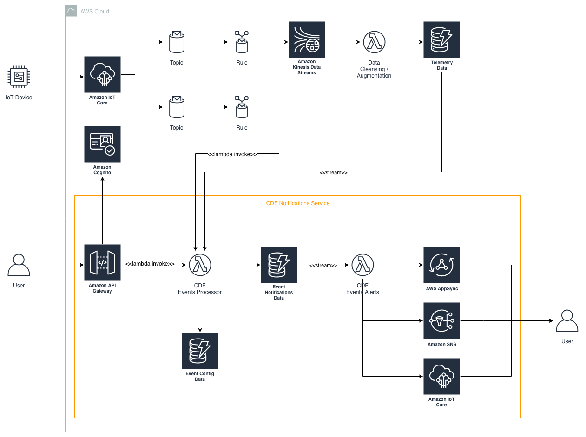

# NOTIFICATIONS: Design

The CDF Notifications service is comprised of 2 micro-services:  the CDF Events Processor, and the CDF Events Alerts. 

## High Level Architecture



## Processing Pipeline


## Events Processor

The Events Processor module is responsible for receiving events from external data sources, transforming to a common message format, filtering based on configured subscriptions, and finally storing the generated alerts for later forwarding by the Events Alerts module.

The Events Processor is implemented as a fat lambda, exposing a management REST API, along with multiple Lambda handler entry points for DynamoDB Stream triggers, and direct Lambda invocations.

Event definitions are defined which are comprised of the data sources to monitor, and the rule to apply.  Subscribers then create subscriptions for specific events occurring.  An example domain model:


## API

The following REST API endpoints are exposed to configure events sources, events, and to allow user's to manage their subscriptions:

For a full definition of the endpoint including a description of the parameters, request and response bodies, and examples, refer to the [swagger definition](./swagger.yml).

Endpoint | Description
---|---
`POST /eventsources` | Creates a new event source, both the integration itself and its metadata
`GET /eventsources` | List all event sources
`GET /eventsources/{eventsourceId}` | Returns a specific event source
`DELETE /eventsources/{eventsourceId}` | Deletes a specific event source, along with all its associated events and subscriptions
`POST /eventsources/{eventSourceId}/events` | Defines a new event
`GET /eventsources/{eventSourceId}/events` | Lists all events for a specific event source
`GET /events/{eventId}` | Returns a specific event
`DELETE /events/{eventId}` | Deletes an specific event, along with all its related subscriptions
`POST /events/{eventId}/subscriptions` | Subscribes to an event
`GET /events/{eventId}/subscriptions` | Lists all subscriptions for a specific event
`GET /subscriptions/{subscriptionId}` | Returns a specific event
`GET /user/{userId}/subscriptions` | Lists all subscriptions for a user

## Event Sources

The following event sources are supported:

* DynamoDB stream
* IoT Core (Lambda Invoke via IoT Rule)

The following are planned to be suported:

* API Gateway

All incoming events must contain an `eventSourceId` that can be used to match against a configured `EventSource` `eventSourceId`.  If a matching `EventSource` configuration cannot be found, the event is dropped.

Events that are sourced via direct lambda invocation, such as API Gateway or IoT Core, are expected to be in the common event format, whereas events sourced from DynamoDB Streams are converted to the common message format by the Event Processor.

#### DynamoDB Streams

A DynamoDB Stream may be configured as a trigger to the Events Processor service. 

Using DynamoDB streams as a Lambda trigger instead of consuming the DynamoDB Stream via Kinesis was chosen so that we benefit from automatic shard handling of scaling up/down.

Creating a DynamoDB Stream event source via the REST API will enable the stream if it is not already enabled on the table, whereas deleting the event source via the REST API will not disable the stream on the table incase since enabling, an external consumer has started consuming the stream.

The `eventSourceARN` in the incoming lambda event from the DynamoDB Stream trigger is used to determine which events are subject to processing by extracting the table portion of the Arn and matching it to an `EventSource `by its `eventSourceId`. 

* Example eventSourceARN:  a`rn:aws:dynamodb:us-west-2:{account-id}:table/ExampleTableWithStream/stream/2015-06-27T00:48:05.899`
* Corresponding eventSourceId:  `arn:aws:dynamodb:us-west-2:{account-id}:table/ExampleTableWithStream`

The items primary key, sort key, and attributes, are extracted from the `NewImage` section of the event and transformed into the common event format for filtering.

#### IoT Core

Creating an IoT Core event source via the REST API creates an IoT Rule to forward the event message.  Deleting via the REST API will remove the IoT Rule.

It is expected that the incoming event being forwarded from IoT Core (via an IoT Rule) is already in the common event format (defined as part of the IoT Rule SQL), therefore will not need transforming.'


## Events

Once an event source is configured, the next step is to configure an Event trigger. The Event trigger evaluates the incoming event and conditionally resolves the event based on the configured Event rule.

#### Event Trigger Format

The following represents the type interface for an Event trigger. The minimum configuration required is to include name, conditions and templates. The additional properties can be configured to define a more granular trigger.

```typescript
interface EventResource {
    eventId: string;
    eventSourceId: string;
    name: string;
    conditions: EventConditions;
    ruleParameters: string[];
    enabled: boolean;

    // a map of templates
    templates: TemplateMap;

    // the defined templates are then associated with a potential target
    supportedTargets: TargetTemplateMap;
}

interface EventConditions {
    all?:EventConditions|EventCondition[];
    any?:EventConditions|EventCondition[];
}

interface EventCondition {
    fact:string;
    operator:string;
    value:number|string|boolean|EventFactCondition;
}

interface EventFactCondition {
    fact:string;
}

type TemplateMap = { [key: string] : string};

type TargetTemplateMap = { [key in EventTargetType] : string};

enum EventTargetType {
    EMAIL = 'email',
    SMS = 'sms',
    MQTT = 'mqtt',
    DYNAMODB = 'dynamodb'
}
```
#### Sample Event Trigger Configuration API Request
```
{
    "name": "Battery alert",
    "conditions": {
    	"all": [{
    		"fact": "batteryLevel",
    		"operator": "lessThanInclusive",
    		"value": "$bl"
    	}]
    },
    "supportedTargets": {
        "email": "default",
        "sms": "small"
    },
    "templates": {
        "default": "The battery for bowl {{=it.principalValue}} is low.",
    	"small": "{{=it.principalValue}} battery low"
    }
}
```

#### Supported Condition Operators

**String and Numeric operators**

- _equal_ - fact must equal value
- _notEqual_ - fact must not equal value

**Numeric operators**

- _lessThan_ - fact must be less than value
- _lessThanInclusive_ - fact must be less than or equal to value
- _greaterThan_ - fact must be greater than value
- _greaterThanInclusive_ - fact must be greater than or equal to value

**Array operators**

- _in_ - fact must be included in value (an array)
- _notIn_ - fact must not be included in value (an array)
- _contains_ - fact (an array) must include value
- _doesNotContain_ - fact (an array) must not include value

#### Common Event Format

The `principal` represents the object that is the focus of the event message.  As an example, it could be the thing name or device id if the event message originated from a device, or a user id if it originated directly from a user.

```typescript
interface CommonEvent {
    eventSourceId: string;
    principal: string;
    principalValue: string;
    attributes?: { [key: string] : string|boolean|number|string[]|number[] };
}
```

#### Referencing the values in Event Templates

`it.` represents the incoming message.  Any attributes on that incoming message will be accessivle via `it.`.  The internal attributes that we use, that include eventSourceId, principal, and principalValue are also added to `it.` but prefixed with `__` to avoid clashes. lets say if the incoming dynamodb item had a field called `temperature` that would be accessible as `it.temperature`


## Event Filtering

Takes as input an event of the common event format.  First performs a lookup to see if any subscriptions for the event are configured for the event source, principal and principal value.  If subscriptions are configured, then a ruleset specific for the principal is loaded.  If any of the subscription rules for the principal pass, and the subscription has not been alerted, the event alert is stored in DynamoDB for later dispatching by the Events Alerts module.  If the subscription rules for the principal do not pass, and the subscription had been alerted, the alerted flag is reset.

#### Common Event Format

The `principal` represents the object that is the focus of the event message.  As an example, it could be the thing name or device id if the event message originated from a device, or a User Id if it originated directly from a user.

```typescript
interface CommonEvent {
    eventSourceId: string;
    principal: string;
    principalValue: string;
    attributes?: { [key: string] : string|boolean|number|string[]|number[] };
}
```

#### Rule Conditions

Each rule requires a its conditions to be defined.  

A condition comprises of a `fact` (the attribute to check), an `operator`(e.g. `LessThan`), and a `value`.  In addition, multiple conditions may be defined within `all` or `any` constructs.

## Data Store

As this module is executed against telemetry, performance is critical, therefore DynamoDB is used as the datastore.  DynamoDB `BatchGetItem` and `BatchWriteItem` methods are used where possible to increase performance.

The following tables exist:

* **EventConfig** - utilizes the [Adjacency List Pattern, GSI Overloading and GSI Sharding best practices](https://docs.aws.amazon.com/amazondynamodb/latest/developerguide/best-practices.html) to store `Event`, `EventSource` and `Subscription` information.  As the data access is read heavy, DynamoDB Accelerator [DAX](https://aws.amazon.com/dynamodb/dax/) is enabled to improve read performance.
* **EventNotifications** - stores all processed alerts.  Streams the creation of new alerts to the Events Alerts modules.

#### EventConfig Data Access Patterns

Access Pattern | Query | Result
--- | --- | ---
Find an EventSource by its id | Use table, PK="ES:{eventSourceId}", SK="type:ES" | EventSource
List all EventSource's | Use sk-gsi1Sort-index, PK="type:ES" | Multiple EventSources
List all active EventSource's | Use sk-gsi1Sort-index, PK="type:ES", SK begins_with "ES:true:" | Multiple EventSources
Find an Event by its id | Use sk-gsi1Sort-index, PK="E:{eventId}", SK begins_with "E:{eventId}:" | Multiple Events including denormalized  EventSource info
List all Event's | Use sk-gsi1Sort-index, PK="type:E" | Multiple Events
List all active Event's | Use sk-gsi1Sort-index, PK="type:E", SK beings_with "E:true:" | Multiple Events
List all Events of a given EventSource | Use table, PK="ES:{eventSourceId}", SK begins_with "E:" | Multiple Events including denormalized EventSource info
Find a Subscription by id | Use table, PK="S:{subscriptionId}", SK="S:{subscriptionId}" | Subscription
List all Subscriptions for an Event | Use sk-gsi1Sort-index, PK="E:{eventId}", SK begins_with "S:" | Multiple Subscriptions
List all Subscriptions for an Event | Use sk-gsi1Sort-index, PK="E:{eventId}", SK begins_with "S:" | Multiple Subscriptions
List all Subscriptions for a User | Use sk-gsi1Sort-index, PK="U:{userId1}", SK begins_with "S:" | Multiple Subscriptions
For an incoming message from an event source, retrieve the rule definitions (Event) and all rule parameter values (Subscriptions) to determine if an event message needs alerting | Use sk-gsi1Sort-index, PK="ES:{eventSourceId}:{principal}:{principalValue}" | Multiple Subscriptions including denormalized Event info

#### EventNotifications Data Access Patterns

Access Pattern | Query | Result
--- | --- | ---
Stream all notifications for a user | Use userId-time-index, PK="{userId}" | Multiple Alerts
Stream all notifications for a user for a specific date range | Use userId-time-index, PK="{userId}", SK BETWEEN "{dateFrom}" and "{dateTo}" | Multiple Alerts
Stream notifications of a particular event for a user | Use userId-gsi2Sort-index, PK="{userId}", SK begins_with "E-{eventId1}-" | Multiple Alerts
Stream notifications of a particular event for a user for a specific date range | Use userId-gsi2Sort-index, PK="{userId}", SK BETWEEN "E-{eventId1}-{dateFrom}" and "E-{eventId1}-{dateTo}" | Multiple Alerts


## Events Alerts

The Events Alerts module is responsible for notifying subscribers of generated alerts which are received by a DynamoDB Stream on the EventNotifications table that is populated by the Event Processor.  Notifications may be pushed to SNS or IoT Core, or alternatively queried in real-time via AppSync (planned feature).
