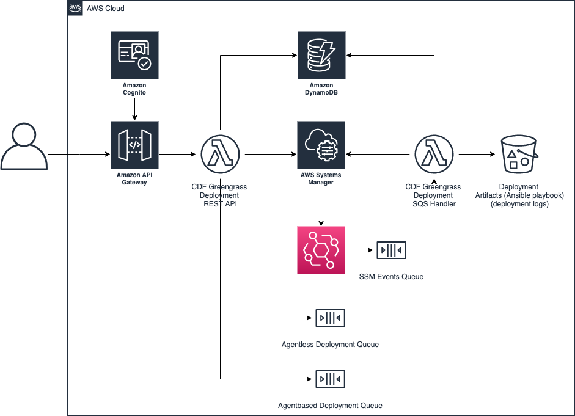

# GREENGRASS Deployment DESIGN

## High Level Architecture

## REST API

Refer to [swagger](./swagger.yaml) document.

## Activating Greengrass Core (SSM Hybrid Activation)

User based Greengrass Core Activation flow

## Deploying Greengrass Core Software (SSM - State Manager)

User based Greengrass Core deployment flow. Utilizes SSM and Ansible

