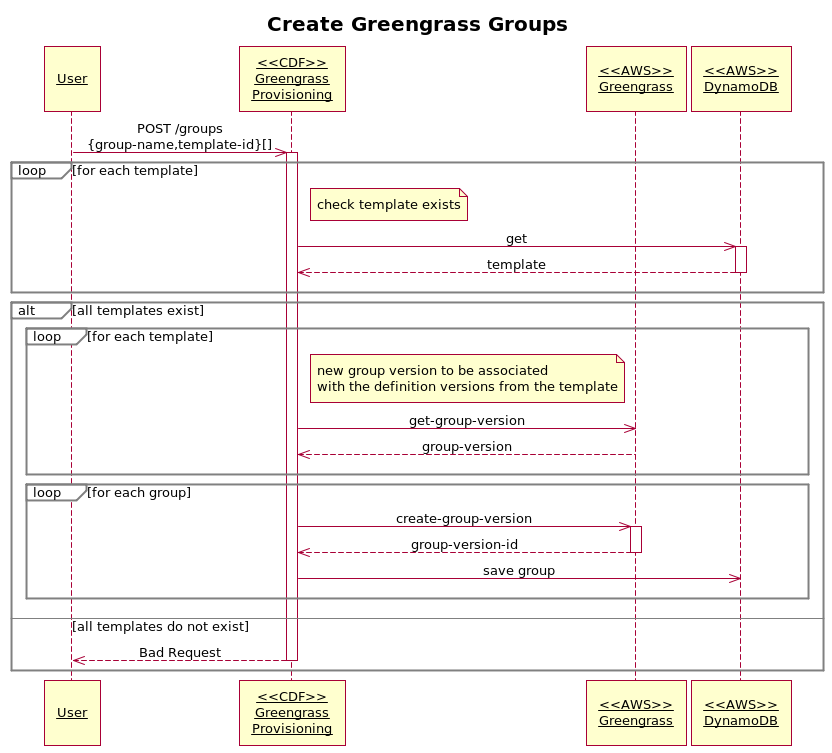

# GREENGRASS PROVISIONING DESIGN

## High Level Architecture

## REST API

Refer to [swagger](./swagger.yml) document.

## Creating/Updating Greengrass Templates

## Creating Greengrass Groups

## Creating Devices

## Creating Deployments

