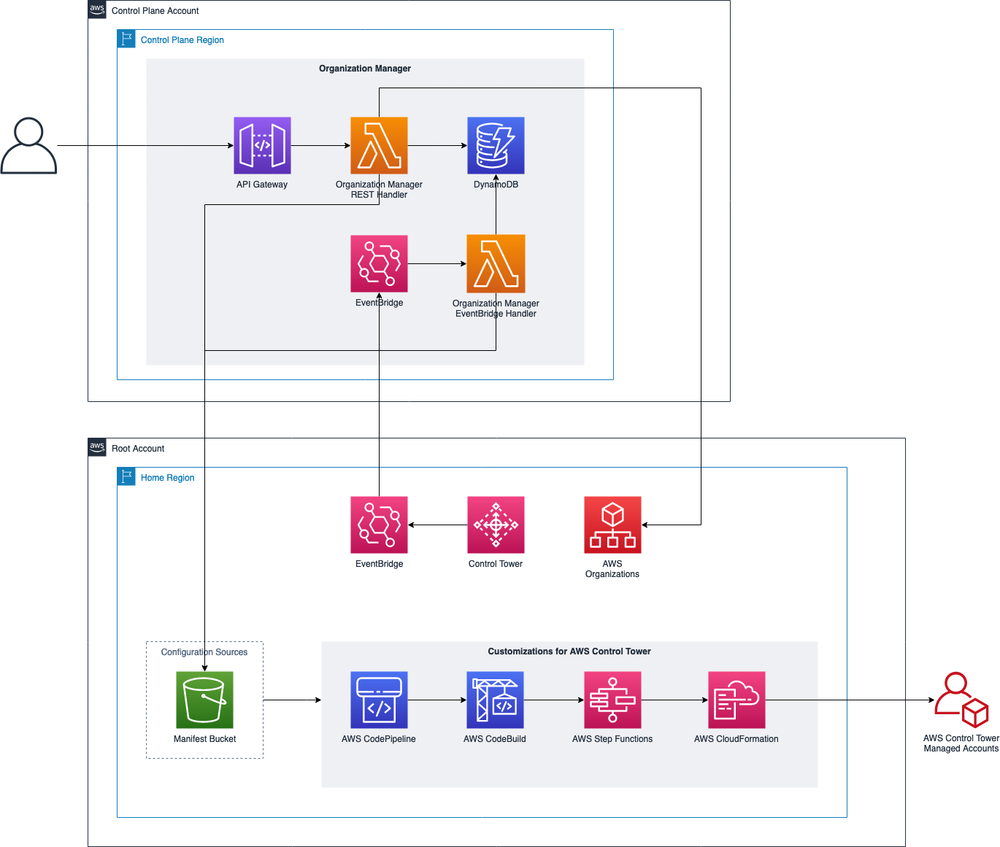

# CDF ORGANIZATION MANAGER OVERVIEW

## Introduction

The default deployment of CDF targets a single account and a single region. However, as your IoT workload grows in size
and complexity, it is a best practice to use a multi-account AWS environment. This is especially true for **Enterprise**
customers, where each business unit is assigned its own AWS account to simplify billing and governance of the workload
environment.

In the past this means that you will need to run the CDF installer in all supported accounts (and regions). Organization
Manager module simplifies the deployment of CDF modules into multiple accounts and regions. It makes use of an AWS
solution
named [Customizations for AWS Control Tower](https://aws.amazon.com/solutions/implementations/customizations-for-aws-control-tower) (**
CfCT**)
to deploy CDF modules (as StackSets) into Control Tower managed AWS accounts.

To determine which CDF module to be deployed, you register the component(defined as a CloudFormation stack or in the CDF
context, a CDF module) and associate it
into [Organizational Unit](https://docs.aws.amazon.com/organizations/latest/userguide/orgs_getting-started_concepts.html)
. When an account is created in that Organizational Unit, Organization Manager will generate **
CfCT** [manifest file](https://docs.aws.amazon.com/controltower/latest/userguide/the-manifest-file.html) and upload it
to the **CfCT** configuration source to trigger the deployment of **StackSets** into Control Tower managed accounts.

Example of manifest file can be found below:

```yaml
resources: # List of resources
  - name: cdf-provisioning
    resource_file: [ String ] [ Local File Path, S3 URL ]
    deployment_targets: # account and/or organizational unit names
      accounts: # array of strings, [0-9]{12}
        - 012345678912
        - AccountName1
      organizational_units: #array of strings
        - OuName1
        - OuName2
    deploy_method: stack_set
    parameters: # List of parameters [SSM, Alfred, Values]
      - parameter_key: [ String ]
        parameter_value: [ String ]
    regions: #list of strings
      - [ String ]
```

`Organization Manager` can be deployed with this following options:

| Features              |                                                                                      Details                                                                                       |
|-----------------------|:----------------------------------------------------------------------------------------------------------------------------------------------------------------------------------:|
| deleteAccountsEnabled | setting this to `true` will move the AWS account into `OU:suspended`(OU created to contain AWS accounts that have been closed and are waiting to be deleted from the organization) |
| createAccountsEnabled |                               setting this to `true` will trigger the creation of AWS account using Control Tower's provided Service Catalog product                               |
| createOUsEnabled      |                                   setting this to `true` will allow `Organization Manager` to create Organizational Unit using AWS Organizations                                   |
| deleteOUsEnabled      |                                   setting this to `true` will allow `Organization Manager` to delete Organizational Unit using AWS Organizations                                   |

## REST API

Refer to the [Swagger](docs/swagger.yml) for a detailed list of the available REST API endpoints.

## Walkthrough

### Example 1: Create an Organizational Unit

The following REST call will register an organizational unit

Replacing the following tokens in the example:

- `<ou-name>` - the name of the organizational unit
- `<ou-id>` - the id the organizational unit

#### Request

```shell
POST /organizationalUnits
Accept: application/vnd.aws-cdf-v1.0+json
Content-Type: application/vnd.aws-cdf-v1.0+json

{
    "name": "<ou-name>",
    "id": "<ou-id>",
    "tags" : {
        "createdBy" : "cdf"
    }
}

```

#### Response

```sh
HTTP: 200 OK
Content-Type: application/vnd.aws-cdf-v1.0+json
location: /organizatoinalUnit/<organizationalUnitId>

```

Once the operation is finished, you can retrieve its details:

#### Request

```shell
GET /organizationalUnits/<ou-id>
Accept: application/vnd.aws-cdf-v1.0+json
```

#### Response

```shell
Content-Type: application/vnd.aws-cdf-v1.0+json
{
    "id": "<ou-id>",
    "name": "<ou-name>",
    "createdAt": "<created-time>"
}
```

### Example 2: Delete an Organizational Unit

You can delete an organizational unit by running the following command:

Replace `<ou-id>` with the id of the organizational unit id

#### Request

```shell
DELETE /organizationalUnits/<ou-id>
Accept: application/vnd.aws-cdf-v1.0+json
```

#### Response

```shell
HTTP: 204 No Content
```

### Example 3: Bulk associate components to an Organizational Unit

A component represents group of AWS resources that can be packaged as CloudFormation template. Everytime a new account
is added to an organizational unit, all components associated with the organizational unit will be deployed to this new
account

Run the command below to associate a list of components to an organizational unit

Replacing the following tokens in the example:

- `<component-name>` - the name of the component
- `<template-location>` - the S3 location of the CloudFormation template for the component
- `<component-description>` - description of the component
- `<parameters>` - object where each key represents the parameter key and each value represents the parameter value for
  the key

#### Request

```shell
POST /organizationalUnits/<ou-id>/bulkComponents
Accept: application/vnd.aws-cdf-v1.0+json
Content-Type: application/vnd.aws-cdf-v1.0+json

{
  "components": [
    {
      "name": "<component-name>",
      "runOrder": 1,
      "resourceFile": "s3://<template-location>",
      "description": "<component-description>",
      "bypassCheck": true,
      "parameters": {<template-parameters>}
    }
  ]
}
```

#### Response

```shell
HTTP: 201 Created
```

As part of the Organization Manager deployment, the installer also deploy some sample templates to buckets in all
supported regions `s3://<bucket-prefix>-<region>/aws-connected-device-framework/0.0.1`

### Example 4: Disassociate components from an Organizational Unit

You can disassociate the components from the organizational unit by running the command below:

```sh
DELETE /organizationalUnits/<ou-id>/components
Accept: application/vnd.aws-cdf-v1.0+json
```

This command is being run when you want to add or remove components from an organizational unit or update the template
location for the components to point to new s3 location.

#### Response

```sh
HTTP: 204 No Content
```

### Example 5: Create an Account

You can create an AWS account (or register an existing AWS account when you deploy Organization Manager
with `createAccountsEnabled` set to false) by running the command below:

Replacing the following tokens in the example:

- `<account-id>` - id of the account
- `<account-name>` - name of the account
- `<ou-id>` - organizational unit id
- `<account-email>` - email for the owner's of the account
- `<sso-user-email>` - sso user's email
- `<sso-user-first-name>` - sso user's first name
- `<sso-user-last-name>` - sso user's last name
- `<region-list>` - array of regions where workload will be deployed for this account

#### Request

```shell
POST /organizationalUnits/<ou-id>/bulkComponents
Accept: application/vnd.aws-cdf-v1.0+json
Content-Type: application/vnd.aws-cdf-v1.0+json

{
  "accountId": "<account-id>",
  "name": "<account-name>",
  "organizationalUnitId": "<ou-id>",
  "email": "<account-email>",
  "ssoEmail": "<sso-user-email>",
  "ssoFirstName": "<sso-user-first-name>",
  "ssoLastName": "<sso-user-last-name>",
  "regions": [<region-list>]
}
```

#### Response

```sh
HTTP: 202 Accepted
```

### Example 6: Modify an Account

You can add another region for the account by running the command below:

Replacing the following tokens in the example:

- `<account-id>` - id of the account
- `<region-list>` - array of regions where workload will be deployed for this account

```shell
POST /accounts/<account-id>
Accept: application/vnd.aws-cdf-v1.0+json
Content-Type: application/vnd.aws-cdf-v1.0+json

{
  "accountId": "<account-id>",
  "regions": <updated-region-list>
}
```

#### Response

```sh
HTTP: 204 No Content
```

### Example 7: Delete an Account

You can delete an account by running the command below, replacing `<account-id>` with the id of the account:

#### Request

```sh
DELETE /accounts/<account-id>
Accept: application/vnd.aws-cdf-v1.0+json
```

#### Response

```sh
HTTP: 204 No Content
```

## High Level Architecture

